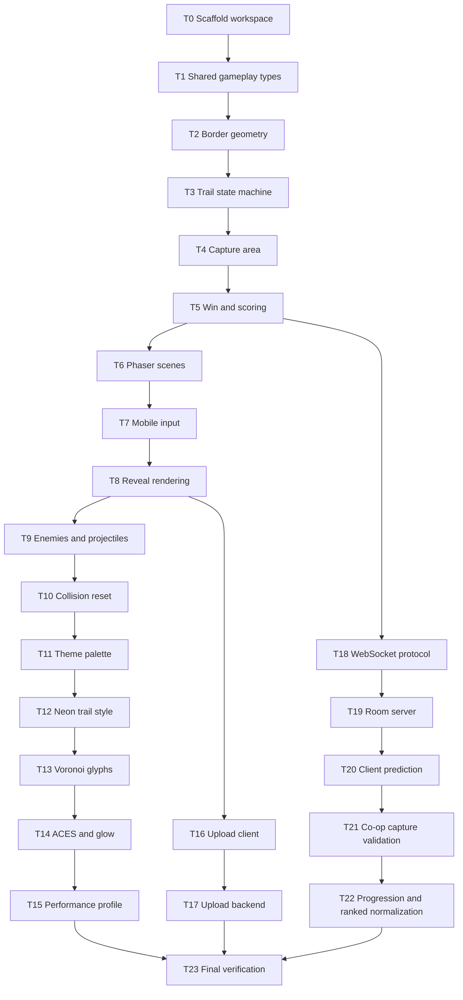

# Dignity Arcade Game Unified Implementation Plan

**Goal:** Build Dignity Arcade Game as a Phaser + TypeScript mobile web territory-reveal arcade game with solo play first, then online co-op, uploaded image support, privacy controls, progression, and a Golden Cyberpunk Egyptian visual identity that stays readable and performant on phones.

**Architecture:** Vite + Phaser client, Vitest unit tests, Playwright smoke tests, Node.js WebSocket backend, and shared TypeScript protocol modules. Core gameplay rules live in deterministic pure TypeScript modules used by both client and server. Phaser scenes render and collect input. The server owns authoritative room state for online co-op.

**Tech Stack:** TypeScript, Vite, Phaser 3, Vitest, Playwright, Node.js, ws, Sharp, ESLint, Prettier.

**Design Source:** `.github/superpower/brainstorm/2026-05-01-dignity-arcade-game-design.md`

**Merge Decision:** The original Golden Cyberpunk Egyptian plan is used only as a source of practical visual ideas: Voronoi glyphs, neon trails, ACES tonemapping, capped particles, dynamic resolution scaling, and shader fallbacks. Raw WebGL 2.0, deferred PBR, FBO sand simulation, 100,000 GPU particles, and 64-step raymarching are rejected for the first production path because they conflict with mobile performance and the approved Phaser-first design.

**Estimated Complexity:** 24 tasks - 3 XS, 8 S, 10 M, 3 L = high production scope, staged behind milestones and feature flags.

**Critical Path:** T0 -> T1 -> T2 -> T3 -> T4 -> T5 -> T6 -> T8 -> T10 -> T15 -> T18 -> T19 -> T21 -> T23

**Risk Assessment:**

- Highest risk task: T21, server-validated co-op capture - capture geometry must stay deterministic across client and server.
- Mitigation: Build solo capture rules first as pure shared logic, add fixture-based tests, then reuse the same modules in the WebSocket room server.
- Secondary risk: T15, mobile performance - visual effects must be optional through `PerformanceProfile`.
- Mitigation: Cap shader loops, cap particles, add reduced-motion and low-end GPU fallbacks, and keep gameplay readable without theme effects.

**Milestones:**

1. Playable Solo Core - T0 through T8
2. Arcade Pressure - T9 through T10
3. Golden Cyberpunk Egyptian Theme - T11 through T15
4. Upload And Privacy - T16 through T17
5. Online Co-op - T18 through T21
6. Production Finish - T22 through T23

---

## Dependency DAG



## Parallel Work

- After T5: T6 client scenes and T18 protocol can be designed in parallel.
- After T8: T9 enemies, T11 theme foundation, and T16 upload client can run independently.
- After T18: T19 server and T20 client net adapter can be split once protocol tests pass.
- After T15, T17, and T22: final verification can run only when all streams are complete.

## Rollback Points

- **Rollback A after T5:** Pure solo rules complete. Rollback command: `git revert --no-commit HEAD~5..HEAD && git commit -m "revert: solo rule foundation"`
- **Rollback B after T10:** Playable solo arcade loop complete. Rollback command: `git revert --no-commit HEAD~5..HEAD && git commit -m "revert: solo arcade loop"`
- **Rollback C after T15:** Theme can be disabled through performance settings. Rollback command: `git revert --no-commit HEAD~5..HEAD && git commit -m "revert: visual theme layer"`
- **Rollback D after T17:** Upload and privacy can be disabled independently. Rollback command: `git revert --no-commit HEAD~2..HEAD && git commit -m "revert: image upload flow"`
- **Rollback E after T21:** Online co-op can be feature-flagged independently. Rollback command: `git revert --no-commit HEAD~4..HEAD && git commit -m "revert: online co-op"`

---

## T0: Scaffold Workspace And Test Harness [Size: M] [Depends: none]

**Step 1: Create scaffold test**

- File: `src/smoke.test.ts`
- Code:

  ```typescript
  import { describe, expect, it } from "vitest";

  describe("workspace smoke test", () => {
    it("runs Vitest", () => {
      expect(1 + 1).toBe(2);
    });
  });
  ```

**Step 2: Create project files**

- File: `package.json`
- Code:

  ```json
  {
    "name": "dignity-arcade-game",
    "private": true,
    "version": "0.1.0",
    "type": "module",
    "scripts": {
      "dev": "vite --host 0.0.0.0",
      "build": "tsc -p tsconfig.json && vite build",
      "preview": "vite preview --host 0.0.0.0",
      "test": "vitest run",
      "test:watch": "vitest",
      "test:e2e": "playwright test",
      "lint": "eslint .",
      "format": "prettier --check .",
      "server:test": "vitest run server shared",
      "perf:mobile": "vitest run src/performance"
    },
    "dependencies": {
      "@vitejs/plugin-basic-ssl": "latest",
      "phaser": "latest",
      "sharp": "latest",
      "ws": "latest"
    },
    "devDependencies": {
      "@playwright/test": "latest",
      "@types/node": "latest",
      "@types/ws": "latest",
      "@typescript-eslint/eslint-plugin": "latest",
      "@typescript-eslint/parser": "latest",
      "eslint": "latest",
      "jsdom": "latest",
      "prettier": "latest",
      "typescript": "latest",
      "vite": "latest",
      "vitest": "latest"
    }
  }
  ```

- File: `tsconfig.json`
- Code:

  ```json
  {
    "compilerOptions": {
      "target": "ES2022",
      "useDefineForClassFields": true,
      "module": "ESNext",
      "lib": ["ES2022", "DOM", "DOM.Iterable"],
      "types": ["vitest/globals", "node"],
      "skipLibCheck": true,
      "moduleResolution": "Bundler",
      "allowImportingTsExtensions": false,
      "resolveJsonModule": true,
      "isolatedModules": true,
      "noEmit": true,
      "strict": true
    },
    "include": ["src", "server", "shared", "tests"]
  }
  ```

- File: `vite.config.ts`
- Code:

  ```typescript
  import { defineConfig } from "vite";

  export default defineConfig({
    server: { port: 5173 },
    test: { environment: "jsdom" },
  });
  ```

- File: `index.html`
- Code:

  ```html
  <!doctype html>
  <html lang="en">
    <head>
      <meta charset="UTF-8" />
      <meta name="viewport" content="width=device-width, initial-scale=1.0" />
      <title>Dignity Arcade Game</title>
    </head>
    <body>
      <div id="game-container"></div>
      <script type="module" src="/src/main.ts"></script>
    </body>
  </html>
  ```

- File: `src/main.ts`
- Code:

  ```typescript
  import Phaser from "phaser";
  import { gameConfig } from "./game/config";

  new Phaser.Game(gameConfig);
  ```

- File: `src/game/config.ts`
- Code:

  ```typescript
  import Phaser from "phaser";

  export const gameConfig: Phaser.Types.Core.GameConfig = {
    type: Phaser.WEBGL,
    parent: "game-container",
    backgroundColor: "#0A0812",
    width: 390,
    height: 844,
    scale: {
      mode: Phaser.Scale.FIT,
      autoCenter: Phaser.Scale.CENTER_BOTH,
    },
    render: {
      antialias: true,
      antialiasGL: true,
      powerPreference: "high-performance",
    },
    scene: [],
  };
  ```

**Step 3: Run scaffold test**

- Command: `npm install && npm test -- src/smoke.test.ts`
- Expected:
  ```text
  Test Files  1 passed (1)
  Tests       1 passed (1)
  ```

**Step 4: Run build**

- Command: `npm run build`
- Expected:
  ```text
  vite build
  built in
  ```

---

## T1: Shared Gameplay Types [Size: S] [Depends: T0]

**Step 1: Write failing tests**

- File: `src/game/types.test.ts`
- Code:

  ```typescript
  import { describe, expect, it } from "vitest";
  import { createInitialGameState } from "./types";

  describe("game types", () => {
    it("creates a hidden image state with zero reveal", () => {
      const state = createInitialGameState("level-1", 800, 600);
      expect(state.levelId).toBe("level-1");
      expect(state.revealedRatio).toBe(0);
      expect(state.players).toHaveLength(1);
      expect(state.players[0].mode).toBe("safe");
    });

    it("starts with no active captures or projectiles", () => {
      const state = createInitialGameState("level-1", 800, 600);
      expect(state.captures).toEqual([]);
      expect(state.projectiles).toEqual([]);
    });
  });
  ```

**Step 2: Run test and verify failure**

- Command: `npm test -- src/game/types.test.ts`
- Expected: `FAIL - Cannot find module './types'`

**Step 3: Implement types**

- File: `src/game/types.ts`
- Code:

  ```typescript
  export type Point = { x: number; y: number };
  export type PlayerMode = "safe" | "drawing" | "hit" | "won";
  export type EnemyKind = "chaser" | "shooter" | "orbiter" | "disruptor";

  export type Trail = {
    playerId: string;
    points: Point[];
    startedAt: number;
  };

  export type CaptureRegion = {
    id: string;
    polygon: Point[];
    area: number;
  };

  export type PlayerState = {
    id: string;
    position: Point;
    lastSafePosition: Point;
    mode: PlayerMode;
    health: number;
    score: number;
    activeTrail: Trail | null;
  };

  export type EnemyState = {
    id: string;
    kind: EnemyKind;
    position: Point;
    velocity: Point;
  };

  export type ProjectileState = {
    id: string;
    ownerEnemyId: string;
    position: Point;
    velocity: Point;
    radius: number;
  };

  export type GameState = {
    levelId: string;
    imageSize: { width: number; height: number };
    revealedRatio: number;
    players: PlayerState[];
    captures: CaptureRegion[];
    enemies: EnemyState[];
    projectiles: ProjectileState[];
    won: boolean;
  };

  export function createInitialGameState(
    levelId: string,
    width: number,
    height: number,
  ): GameState {
    const start = { x: 0, y: 0 };
    return {
      levelId,
      imageSize: { width, height },
      revealedRatio: 0,
      players: [
        {
          id: "p1",
          position: start,
          lastSafePosition: start,
          mode: "safe",
          health: 3,
          score: 0,
          activeTrail: null,
        },
      ],
      captures: [],
      enemies: [],
      projectiles: [],
      won: false,
    };
  }
  ```

**Step 4: Run test and verify pass**

- Command: `npm test -- src/game/types.test.ts`
- Expected: `Test Files  1 passed (1)`

---

## T2: Border And Safe-Zone Geometry [Size: S] [Depends: T1]

**Step 1: Write failing tests**

- File: `src/game/geometry/border.test.ts`
- Code:

  ```typescript
  import { describe, expect, it } from "vitest";
  import { isOnOuterBorder, isPointInPolygon, isSafePoint } from "./border";

  const size = { width: 100, height: 80 };
  const capture = [
    { x: 10, y: 10 },
    { x: 40, y: 10 },
    { x: 40, y: 40 },
    { x: 10, y: 40 },
  ];

  describe("border geometry", () => {
    it("treats image edges as safe outer border", () => {
      expect(isOnOuterBorder({ x: 0, y: 20 }, size)).toBe(true);
      expect(isOnOuterBorder({ x: 50, y: 80 }, size)).toBe(true);
    });

    it("treats interior points as off border", () => {
      expect(isOnOuterBorder({ x: 50, y: 50 }, size)).toBe(false);
    });

    it("detects points inside captured polygons", () => {
      expect(isPointInPolygon({ x: 20, y: 20 }, capture)).toBe(true);
      expect(isPointInPolygon({ x: 60, y: 20 }, capture)).toBe(false);
    });

    it("treats captured territory as safe", () => {
      expect(isSafePoint({ x: 20, y: 20 }, size, [capture])).toBe(true);
    });
  });
  ```

**Step 2: Run test and verify failure**

- Command: `npm test -- src/game/geometry/border.test.ts`
- Expected: `FAIL - Cannot find module './border'`

**Step 3: Implement geometry**

- File: `src/game/geometry/border.ts`
- Code:

  ```typescript
  import type { Point } from "../types";

  export type ImageSize = { width: number; height: number };

  export function isOnOuterBorder(
    point: Point,
    size: ImageSize,
    tolerance = 1,
  ): boolean {
    const onLeft = Math.abs(point.x) <= tolerance;
    const onRight = Math.abs(point.x - size.width) <= tolerance;
    const onTop = Math.abs(point.y) <= tolerance;
    const onBottom = Math.abs(point.y - size.height) <= tolerance;
    return onLeft || onRight || onTop || onBottom;
  }

  export function isPointInPolygon(point: Point, polygon: Point[]): boolean {
    let inside = false;
    for (let i = 0, j = polygon.length - 1; i < polygon.length; j = i++) {
      const a = polygon[i];
      const b = polygon[j];
      const intersects =
        a.y > point.y !== b.y > point.y &&
        point.x < ((b.x - a.x) * (point.y - a.y)) / (b.y - a.y) + a.x;
      if (intersects) inside = !inside;
    }
    return inside;
  }

  export function isSafePoint(
    point: Point,
    size: ImageSize,
    captures: Point[][],
  ): boolean {
    return (
      isOnOuterBorder(point, size) ||
      captures.some((polygon) => isPointInPolygon(point, polygon))
    );
  }
  ```

**Step 4: Run test and verify pass**

- Command: `npm test -- src/game/geometry/border.test.ts`
- Expected: `Test Files  1 passed (1)`

---

## T3: Trail State Machine [Size: M] [Depends: T2]

**Step 1: Write failing tests**

- File: `src/game/capture/trailState.test.ts`
- Code:

  ```typescript
  import { describe, expect, it } from "vitest";
  import { cancelTrail, movePlayer } from "./trailState";
  import { createInitialGameState } from "../types";

  const size = { width: 100, height: 100 };

  describe("trail state", () => {
    it("keeps player safe while moving along border", () => {
      const state = createInitialGameState("level", 100, 100);
      const next = movePlayer(state, "p1", { x: 0, y: 20 }, 100);
      expect(next.players[0].mode).toBe("safe");
      expect(next.players[0].activeTrail).toBeNull();
    });

    it("starts trail when player leaves safe border", () => {
      const state = createInitialGameState("level", size.width, size.height);
      const next = movePlayer(state, "p1", { x: 20, y: 20 }, 100);
      expect(next.players[0].mode).toBe("drawing");
      expect(next.players[0].activeTrail?.points).toEqual([
        { x: 0, y: 0 },
        { x: 20, y: 20 },
      ]);
    });

    it("extends active trail while drawing", () => {
      const state = movePlayer(
        createInitialGameState("level", 100, 100),
        "p1",
        { x: 20, y: 20 },
        100,
      );
      const next = movePlayer(state, "p1", { x: 30, y: 20 }, 120);
      expect(next.players[0].activeTrail?.points).toHaveLength(3);
    });

    it("cancels trail and restores last safe position", () => {
      const drawing = movePlayer(
        createInitialGameState("level", 100, 100),
        "p1",
        { x: 20, y: 20 },
        100,
      );
      const next = cancelTrail(drawing, "p1");
      expect(next.players[0].position).toEqual({ x: 0, y: 0 });
      expect(next.players[0].mode).toBe("safe");
      expect(next.players[0].activeTrail).toBeNull();
    });
  });
  ```

**Step 2: Run test and verify failure**

- Command: `npm test -- src/game/capture/trailState.test.ts`
- Expected: `FAIL - Cannot find module './trailState'`

**Step 3: Implement trail state**

- File: `src/game/capture/trailState.ts`
- Code:

  ```typescript
  import { isSafePoint } from "../geometry/border";
  import type { GameState, PlayerState, Point } from "../types";

  function replacePlayer(state: GameState, player: PlayerState): GameState {
    return {
      ...state,
      players: state.players.map((item) =>
        item.id === player.id ? player : item,
      ),
    };
  }

  export function movePlayer(
    state: GameState,
    playerId: string,
    position: Point,
    timestamp: number,
  ): GameState {
    const player = state.players.find((item) => item.id === playerId);
    if (!player) return state;

    const capturePolygons = state.captures.map((capture) => capture.polygon);
    const safe = isSafePoint(position, state.imageSize, capturePolygons);

    if (player.mode === "drawing") {
      const trail = {
        ...player.activeTrail!,
        points: [...player.activeTrail!.points, position],
      };
      const nextPlayer: PlayerState = safe
        ? {
            ...player,
            position,
            lastSafePosition: position,
            mode: "safe",
            activeTrail: trail,
          }
        : { ...player, position, mode: "drawing", activeTrail: trail };
      return replacePlayer(state, nextPlayer);
    }

    if (safe) {
      return replacePlayer(state, {
        ...player,
        position,
        lastSafePosition: position,
        mode: "safe",
        activeTrail: null,
      });
    }

    return replacePlayer(state, {
      ...player,
      position,
      mode: "drawing",
      activeTrail: {
        playerId,
        points: [player.lastSafePosition, position],
        startedAt: timestamp,
      },
    });
  }

  export function cancelTrail(state: GameState, playerId: string): GameState {
    const player = state.players.find((item) => item.id === playerId);
    if (!player) return state;
    return replacePlayer(state, {
      ...player,
      position: player.lastSafePosition,
      mode: "safe",
      activeTrail: null,
    });
  }
  ```

**Step 4: Run test and verify pass**

- Command: `npm test -- src/game/capture/trailState.test.ts`
- Expected: `Test Files  1 passed (1)`

---

## T4: Capture Area Calculation [Size: M] [Depends: T3]

**Step 1: Write failing tests**

- File: `src/game/capture/captureArea.test.ts`
- Code:

  ```typescript
  import { describe, expect, it } from "vitest";
  import { calculatePolygonArea, commitCaptureFromTrail } from "./captureArea";
  import { createInitialGameState } from "../types";

  describe("capture area", () => {
    it("calculates rectangle area", () => {
      const polygon = [
        { x: 0, y: 0 },
        { x: 20, y: 0 },
        { x: 20, y: 10 },
        { x: 0, y: 10 },
      ];
      expect(calculatePolygonArea(polygon)).toBe(200);
    });

    it("commits closed trail as capture", () => {
      const state = createInitialGameState("level", 100, 100);
      const trail = {
        playerId: "p1",
        startedAt: 0,
        points: [
          { x: 0, y: 0 },
          { x: 20, y: 0 },
          { x: 20, y: 20 },
          { x: 0, y: 20 },
          { x: 0, y: 0 },
        ],
      };
      const next = commitCaptureFromTrail(state, trail);
      expect(next.captures).toHaveLength(1);
      expect(next.captures[0].area).toBe(400);
      expect(next.revealedRatio).toBeCloseTo(0.04);
    });

    it("rejects open trails", () => {
      const state = createInitialGameState("level", 100, 100);
      const trail = {
        playerId: "p1",
        startedAt: 0,
        points: [
          { x: 0, y: 0 },
          { x: 20, y: 20 },
        ],
      };
      expect(commitCaptureFromTrail(state, trail)).toBe(state);
    });
  });
  ```

**Step 2: Run test and verify failure**

- Command: `npm test -- src/game/capture/captureArea.test.ts`
- Expected: `FAIL - Cannot find module './captureArea'`

**Step 3: Implement capture area**

- File: `src/game/capture/captureArea.ts`
- Code:

  ```typescript
  import type { CaptureRegion, GameState, Point, Trail } from "../types";

  export function calculatePolygonArea(points: Point[]): number {
    if (points.length < 3) return 0;
    let sum = 0;
    for (let i = 0; i < points.length; i++) {
      const current = points[i];
      const next = points[(i + 1) % points.length];
      sum += current.x * next.y - next.x * current.y;
    }
    return Math.abs(sum) / 2;
  }

  export function isClosedTrail(trail: Trail, tolerance = 1): boolean {
    const first = trail.points[0];
    const last = trail.points[trail.points.length - 1];
    return (
      Math.abs(first.x - last.x) <= tolerance &&
      Math.abs(first.y - last.y) <= tolerance
    );
  }

  export function commitCaptureFromTrail(
    state: GameState,
    trail: Trail,
  ): GameState {
    if (!isClosedTrail(trail)) return state;
    const polygon = trail.points.slice(0, -1);
    const area = calculatePolygonArea(polygon);
    if (area <= 0) return state;
    const capture: CaptureRegion = {
      id: `capture-${state.captures.length + 1}`,
      polygon,
      area,
    };
    const totalArea = state.imageSize.width * state.imageSize.height;
    const revealedArea =
      state.captures.reduce((sum, item) => sum + item.area, 0) + area;
    return {
      ...state,
      captures: [...state.captures, capture],
      revealedRatio: Math.min(1, revealedArea / totalArea),
      players: state.players.map((player) =>
        player.id === trail.playerId
          ? { ...player, mode: "safe", activeTrail: null }
          : player,
      ),
    };
  }
  ```

**Step 4: Run test and verify pass**

- Command: `npm test -- src/game/capture/captureArea.test.ts`
- Expected: `Test Files  1 passed (1)`

---

## T5: Win Condition And Scoring [Size: S] [Depends: T4]

**Step 1: Write failing tests**

- File: `src/game/scoring.test.ts`
- Code:

  ```typescript
  import { describe, expect, it } from "vitest";
  import { calculateCaptureScore, hasWon, WIN_REVEAL_RATIO } from "./scoring";

  describe("scoring", () => {
    it("wins at exactly 75 percent reveal", () => {
      expect(WIN_REVEAL_RATIO).toBe(0.75);
      expect(hasWon(0.75)).toBe(true);
      expect(hasWon(0.749)).toBe(false);
    });

    it("scores larger and riskier captures higher", () => {
      const small = calculateCaptureScore({
        area: 100,
        dangerMultiplier: 1,
        streak: 0,
        coOpBonus: 0,
      });
      const large = calculateCaptureScore({
        area: 100,
        dangerMultiplier: 2,
        streak: 2,
        coOpBonus: 50,
      });
      expect(large).toBeGreaterThan(small);
    });
  });
  ```

**Step 2: Run test and verify failure**

- Command: `npm test -- src/game/scoring.test.ts`
- Expected: `FAIL - Cannot find module './scoring'`

**Step 3: Implement scoring**

- File: `src/game/scoring.ts`
- Code:

  ```typescript
  export const WIN_REVEAL_RATIO = 0.75;

  export type CaptureScoreInput = {
    area: number;
    dangerMultiplier: number;
    streak: number;
    coOpBonus: number;
  };

  export function hasWon(revealedRatio: number): boolean {
    return revealedRatio >= WIN_REVEAL_RATIO;
  }

  export function calculateCaptureScore(input: CaptureScoreInput): number {
    const base = Math.floor(input.area);
    const streakBonus = input.streak * 25;
    return Math.max(
      0,
      Math.floor(base * input.dangerMultiplier + streakBonus + input.coOpBonus),
    );
  }
  ```

**Step 4: Run test and verify pass**

- Command: `npm test -- src/game/scoring.test.ts`
- Expected: `Test Files  1 passed (1)`

**Rollback Point A Verification**

- Command: `npm test -- src/game`
- Expected: `Test Files  5 passed`

---

## T6: Phaser Boot, Home, And Game Scenes [Size: M] [Depends: T5]

**Step 1: Write failing scene registry test**

- File: `src/scenes/sceneRegistry.test.ts`
- Code:

  ```typescript
  import { describe, expect, it } from "vitest";
  import { sceneRegistry } from "./sceneRegistry";

  describe("sceneRegistry", () => {
    it("contains home and game scenes", () => {
      expect(sceneRegistry.map((scene) => scene.key)).toEqual([
        "BootScene",
        "HomeScene",
        "GameScene",
      ]);
    });
  });
  ```

**Step 2: Run test and verify failure**

- Command: `npm test -- src/scenes/sceneRegistry.test.ts`
- Expected: `FAIL - Cannot find module './sceneRegistry'`

**Step 3: Implement scene files**

- File: `src/scenes/BootScene.ts`
- Code:

  ```typescript
  import Phaser from "phaser";

  export class BootScene extends Phaser.Scene {
    constructor() {
      super("BootScene");
    }

    create(): void {
      this.scene.start("HomeScene");
    }
  }
  ```

- File: `src/scenes/HomeScene.ts`
- Code:

  ```typescript
  import Phaser from "phaser";

  export class HomeScene extends Phaser.Scene {
    constructor() {
      super("HomeScene");
    }

    create(): void {
      const centerX = this.scale.width / 2;
      this.add
        .text(centerX, 96, "Dignity Arcade", {
          color: "#FFD700",
          fontSize: "32px",
        })
        .setOrigin(0.5);
      this.add
        .text(centerX, 180, "Quick Play", {
          color: "#00FFFF",
          fontSize: "28px",
        })
        .setOrigin(0.5)
        .setInteractive()
        .on("pointerup", () => this.scene.start("GameScene"));
      this.add
        .text(centerX, 244, "Create Room", {
          color: "#FFFFFF",
          fontSize: "24px",
        })
        .setOrigin(0.5);
      this.add
        .text(centerX, 300, "Upload Image", {
          color: "#FFFFFF",
          fontSize: "24px",
        })
        .setOrigin(0.5);
    }
  }
  ```

- File: `src/scenes/GameScene.ts`
- Code:

  ```typescript
  import Phaser from "phaser";
  import { createInitialGameState, type GameState } from "../game/types";

  export class GameScene extends Phaser.Scene {
    private state!: GameState;

    constructor() {
      super("GameScene");
    }

    create(): void {
      this.state = createInitialGameState("solo-default", 320, 480);
      this.add
        .rectangle(195, 360, 320, 480, 0x0a0812)
        .setStrokeStyle(3, 0xffd700);
      this.add.text(24, 24, "Reveal 0%", {
        color: "#00FFFF",
        fontSize: "18px",
      });
    }
  }
  ```

- File: `src/scenes/sceneRegistry.ts`
- Code:

  ```typescript
  import { BootScene } from "./BootScene";
  import { GameScene } from "./GameScene";
  import { HomeScene } from "./HomeScene";

  export const sceneRegistry = [
    { key: "BootScene", scene: BootScene },
    { key: "HomeScene", scene: HomeScene },
    { key: "GameScene", scene: GameScene },
  ];
  ```

- File: `src/game/config.ts`
- Replace code with:

  ```typescript
  import Phaser from "phaser";
  import { sceneRegistry } from "../scenes/sceneRegistry";

  export const gameConfig: Phaser.Types.Core.GameConfig = {
    type: Phaser.WEBGL,
    parent: "game-container",
    backgroundColor: "#0A0812",
    width: 390,
    height: 844,
    scale: {
      mode: Phaser.Scale.FIT,
      autoCenter: Phaser.Scale.CENTER_BOTH,
    },
    render: {
      antialias: true,
      antialiasGL: true,
      powerPreference: "high-performance",
    },
    scene: sceneRegistry.map((item) => item.scene),
  };
  ```

**Step 4: Run test and verify pass**

- Command: `npm test -- src/scenes/sceneRegistry.test.ts`
- Expected: `Test Files  1 passed (1)`

---

## T7: Mobile Joystick And Keyboard Fallback [Size: M] [Depends: T6]

**Step 1: Write failing tests**

- File: `src/input/VirtualJoystick.test.ts`
- Code:

  ```typescript
  import { describe, expect, it } from "vitest";
  import { normalizeJoystickVector, applyDeadZone } from "./VirtualJoystick";

  describe("VirtualJoystick", () => {
    it("normalizes long vectors to length 1", () => {
      expect(normalizeJoystickVector({ x: 20, y: 0 })).toEqual({ x: 1, y: 0 });
    });

    it("zeros vectors inside dead zone", () => {
      expect(applyDeadZone({ x: 0.05, y: 0.05 }, 0.2)).toEqual({ x: 0, y: 0 });
    });

    it("keeps vectors outside dead zone", () => {
      expect(applyDeadZone({ x: 0.5, y: 0 }, 0.2)).toEqual({ x: 0.5, y: 0 });
    });
  });
  ```

**Step 2: Run test and verify failure**

- Command: `npm test -- src/input/VirtualJoystick.test.ts`
- Expected: `FAIL - Cannot find module './VirtualJoystick'`

**Step 3: Implement joystick math**

- File: `src/input/VirtualJoystick.ts`
- Code:

  ```typescript
  import type { Point } from "../game/types";

  export function normalizeJoystickVector(vector: Point): Point {
    const length = Math.hypot(vector.x, vector.y);
    if (length === 0) return { x: 0, y: 0 };
    return { x: vector.x / length, y: vector.y / length };
  }

  export function applyDeadZone(vector: Point, deadZone: number): Point {
    return Math.hypot(vector.x, vector.y) < deadZone ? { x: 0, y: 0 } : vector;
  }

  export class VirtualJoystick {
    private direction: Point = { x: 0, y: 0 };

    setDirection(vector: Point): void {
      this.direction = applyDeadZone(normalizeJoystickVector(vector), 0.15);
    }

    getDirection(): Point {
      return this.direction;
    }
  }
  ```

**Step 4: Run test and verify pass**

- Command: `npm test -- src/input/VirtualJoystick.test.ts`
- Expected: `Test Files  1 passed (1)`

---

## T8: Reveal Mask Rendering Adapter [Size: M] [Depends: T7]

**Step 1: Write failing tests**

- File: `src/render/RevealMask.test.ts`
- Code:

  ```typescript
  import { describe, expect, it } from "vitest";
  import { calculateRevealPercentText, makeMaskResolution } from "./RevealMask";

  describe("RevealMask", () => {
    it("formats reveal percent for HUD", () => {
      expect(calculateRevealPercentText(0.754)).toBe("Reveal 75%");
    });

    it("caps mask resolution for mobile performance", () => {
      expect(makeMaskResolution(4000, 3000, 512)).toEqual({
        width: 512,
        height: 384,
      });
    });
  });
  ```

**Step 2: Run test and verify failure**

- Command: `npm test -- src/render/RevealMask.test.ts`
- Expected: `FAIL - Cannot find module './RevealMask'`

**Step 3: Implement adapter**

- File: `src/render/RevealMask.ts`
- Code:

  ```typescript
  export function calculateRevealPercentText(revealedRatio: number): string {
    return `Reveal ${Math.floor(revealedRatio * 100)}%`;
  }

  export function makeMaskResolution(
    width: number,
    height: number,
    maxSide: number,
  ): { width: number; height: number } {
    const scale = Math.min(1, maxSide / Math.max(width, height));
    return {
      width: Math.round(width * scale),
      height: Math.round(height * scale),
    };
  }
  ```

**Step 4: Run test and verify pass**

- Command: `npm test -- src/render/RevealMask.test.ts`
- Expected: `Test Files  1 passed (1)`

---

## T9: Enemy And Projectile Systems [Size: M] [Depends: T8]

**Step 1: Write failing tests**

- File: `src/enemies/EnemySpawner.test.ts`
- Code:

  ```typescript
  import { describe, expect, it } from "vitest";
  import { createEnemyWave, MAX_PROJECTILES_MOBILE } from "./EnemySpawner";

  describe("EnemySpawner", () => {
    it("creates readable alien kinds", () => {
      const wave = createEnemyWave(2, { width: 300, height: 400 });
      expect(wave.map((enemy) => enemy.kind)).toContain("chaser");
      expect(wave.map((enemy) => enemy.kind)).toContain("shooter");
    });

    it("caps mobile projectiles", () => {
      expect(MAX_PROJECTILES_MOBILE).toBeLessThanOrEqual(80);
    });
  });
  ```

**Step 2: Run test and verify failure**

- Command: `npm test -- src/enemies/EnemySpawner.test.ts`
- Expected: `FAIL - Cannot find module './EnemySpawner'`

**Step 3: Implement enemy spawner**

- File: `src/enemies/EnemySpawner.ts`
- Code:

  ```typescript
  import type { EnemyState } from "../game/types";

  export const MAX_PROJECTILES_MOBILE = 64;

  export function createEnemyWave(
    level: number,
    bounds: { width: number; height: number },
  ): EnemyState[] {
    const kinds: EnemyState["kind"][] = [
      "chaser",
      "shooter",
      "orbiter",
      "disruptor",
    ];
    const count = Math.min(2 + level, 8);
    return Array.from({ length: count }, (_, index) => ({
      id: `enemy-${index + 1}`,
      kind: kinds[index % kinds.length],
      position: {
        x: bounds.width * ((index + 1) / (count + 1)),
        y: bounds.height * 0.35,
      },
      velocity: { x: index % 2 === 0 ? 30 : -30, y: 0 },
    }));
  }
  ```

**Step 4: Run test and verify pass**

- Command: `npm test -- src/enemies/EnemySpawner.test.ts`
- Expected: `Test Files  1 passed (1)`

---

## T10: Collision Reset Behavior [Size: M] [Depends: T9]

**Step 1: Write failing tests**

- File: `src/game/collision.test.ts`
- Code:

  ```typescript
  import { describe, expect, it } from "vitest";
  import { createInitialGameState } from "./types";
  import { cancelTrailOnProjectileHit, circleHitsPolyline } from "./collision";
  import { movePlayer } from "./capture/trailState";

  describe("collision", () => {
    it("detects projectile hitting active trail", () => {
      const trail = [
        { x: 0, y: 0 },
        { x: 20, y: 0 },
      ];
      expect(circleHitsPolyline({ x: 10, y: 1 }, 3, trail)).toBe(true);
    });

    it("cancels active trail on hit", () => {
      const drawing = movePlayer(
        createInitialGameState("level", 100, 100),
        "p1",
        { x: 20, y: 20 },
        0,
      );
      const next = cancelTrailOnProjectileHit(drawing, "p1");
      expect(next.players[0].position).toEqual({ x: 0, y: 0 });
      expect(next.players[0].activeTrail).toBeNull();
    });
  });
  ```

**Step 2: Run test and verify failure**

- Command: `npm test -- src/game/collision.test.ts`
- Expected: `FAIL - Cannot find module './collision'`

**Step 3: Implement collision**

- File: `src/game/collision.ts`
- Code:

  ```typescript
  import { cancelTrail } from "./capture/trailState";
  import type { GameState, Point } from "./types";

  function distanceToSegment(point: Point, a: Point, b: Point): number {
    const dx = b.x - a.x;
    const dy = b.y - a.y;
    const lengthSq = dx * dx + dy * dy;
    if (lengthSq === 0) return Math.hypot(point.x - a.x, point.y - a.y);
    const t = Math.max(
      0,
      Math.min(1, ((point.x - a.x) * dx + (point.y - a.y) * dy) / lengthSq),
    );
    return Math.hypot(point.x - (a.x + t * dx), point.y - (a.y + t * dy));
  }

  export function circleHitsPolyline(
    center: Point,
    radius: number,
    points: Point[],
  ): boolean {
    for (let i = 1; i < points.length; i++) {
      if (distanceToSegment(center, points[i - 1], points[i]) <= radius)
        return true;
    }
    return false;
  }

  export function cancelTrailOnProjectileHit(
    state: GameState,
    playerId: string,
  ): GameState {
    return cancelTrail(state, playerId);
  }
  ```

**Step 4: Run test and verify pass**

- Command: `npm test -- src/game/collision.test.ts`
- Expected: `Test Files  1 passed (1)`

**Rollback Point B Verification**

- Command: `npm test -- src/game src/input src/render src/enemies src/scenes`
- Expected: `All listed test files passed`

---

## T11: Golden Cyberpunk Egyptian Palette [Size: S] [Depends: T10]

**Step 1: Write failing tests**

- File: `src/theme/palette.test.ts`
- Code:

  ```typescript
  import { describe, expect, it } from "vitest";
  import { PALETTE } from "./palette";

  describe("PALETTE", () => {
    it("exports gold and cyan theme anchors", () => {
      expect(PALETTE.GOLD).toBe(0xffd700);
      expect(PALETTE.CYAN).toBe(0x00ffff);
    });

    it("exports calm readable UI colors", () => {
      expect(PALETTE.VOID).toBe(0x0a0812);
      expect(PALETTE.SAND).toBe(0xc8a96e);
    });

    it("CSS tokens are hex strings", () => {
      Object.values(PALETTE.css).forEach((value) =>
        expect(value).toMatch(/^#[0-9A-F]{6}$/),
      );
    });
  });
  ```

**Step 2: Run test and verify failure**

- Command: `npm test -- src/theme/palette.test.ts`
- Expected: `FAIL - Cannot find module './palette'`

**Step 3: Implement palette**

- File: `src/theme/palette.ts`
- Code:

  ```typescript
  const raw = {
    GOLD: 0xffd700,
    CYAN: 0x00ffff,
    VOID: 0x0a0812,
    BORDER: 0x1a1428,
    AMBER: 0xff8c00,
    MAGENTA: 0xff00cc,
    SAND: 0xc8a96e,
    WHITE: 0xffffff,
  } as const;

  function toCss(value: number): string {
    return `#${value.toString(16).toUpperCase().padStart(6, "0")}`;
  }

  export const PALETTE = {
    ...raw,
    css: Object.fromEntries(
      Object.entries(raw).map(([key, value]) => [key, toCss(value)]),
    ) as Record<keyof typeof raw, string>,
  };
  ```

**Step 4: Run test and verify pass**

- Command: `npm test -- src/theme/palette.test.ts`
- Expected: `Test Files  1 passed (1)`

---

## T12: Neon Trail Style Adapter [Size: S] [Depends: T11]

**Step 1: Write failing tests**

- File: `src/theme/TrailStyle.test.ts`
- Code:

  ```typescript
  import { describe, expect, it } from "vitest";
  import { createTrailStyle } from "./TrailStyle";

  describe("TrailStyle", () => {
    it("uses gold for safe trail and cyan for co-op accent", () => {
      const style = createTrailStyle(false);
      expect(style.primary).toBe(0xffd700);
      expect(style.partner).toBe(0x00ffff);
    });

    it("disables shader requirement in reduced effects mode", () => {
      const style = createTrailStyle(true);
      expect(style.useShader).toBe(false);
    });
  });
  ```

**Step 2: Run test and verify failure**

- Command: `npm test -- src/theme/TrailStyle.test.ts`
- Expected: `FAIL - Cannot find module './TrailStyle'`

**Step 3: Implement trail style**

- File: `src/theme/TrailStyle.ts`
- Code:

  ```typescript
  import { PALETTE } from "./palette";

  export type TrailStyle = {
    primary: number;
    partner: number;
    width: number;
    glowRadius: number;
    useShader: boolean;
  };

  export function createTrailStyle(reducedEffects: boolean): TrailStyle {
    return {
      primary: PALETTE.GOLD,
      partner: PALETTE.CYAN,
      width: 5,
      glowRadius: reducedEffects ? 0 : 0.005,
      useShader: !reducedEffects,
    };
  }
  ```

**Step 4: Run test and verify pass**

- Command: `npm test -- src/theme/TrailStyle.test.ts`
- Expected: `Test Files  1 passed (1)`

---

## T13: Voronoi Hieroglyphic Background PostFX [Size: M] [Depends: T12]

**Step 1: Write failing tests**

- File: `src/theme/VoronoiPostFX.test.ts`
- Code:

  ```typescript
  import { describe, expect, it } from "vitest";
  import { VORONOI_FRAG } from "./VoronoiPostFX";

  describe("VoronoiPostFX", () => {
    it("uses Phaser-compatible mediump GLSL", () => {
      expect(VORONOI_FRAG).toContain("precision mediump float");
    });

    it("uses a capped 3x3 loop", () => {
      expect(VORONOI_FRAG).toMatch(/j\s*=\s*-1\s*;\s*j\s*<=\s*1/);
      expect(VORONOI_FRAG).toMatch(/i\s*=\s*-1\s*;\s*i\s*<=\s*1/);
    });

    it("blends over uMainSampler", () => {
      expect(VORONOI_FRAG).toContain("uMainSampler");
    });
  });
  ```

**Step 2: Run test and verify failure**

- Command: `npm test -- src/theme/VoronoiPostFX.test.ts`
- Expected: `FAIL - Cannot find module './VoronoiPostFX'`

**Step 3: Implement Voronoi shader**

- File: `src/theme/VoronoiPostFX.ts`
- Code:

  ```typescript
  import Phaser from "phaser";

  export const VORONOI_FRAG = `
  precision mediump float;
  uniform sampler2D uMainSampler;
  uniform float time;
  varying vec2 outTexCoord;
  
  vec2 hash2(vec2 p) {
    p = vec2(dot(p, vec2(127.1, 311.7)), dot(p, vec2(269.5, 183.3)));
    return fract(sin(p) * 43758.5453);
  }
  
  void main() {
    vec2 uv = outTexCoord * 8.0;
    vec2 ip = floor(uv);
    vec2 fp = fract(uv);
    float res = 8.0;
    for (int j = -1; j <= 1; j++) {
      for (int i = -1; i <= 1; i++) {
        vec2 b = vec2(float(i), float(j));
        vec2 r = b - fp + 0.5 + 0.45 * sin(time * 0.4 + 6.2831 * hash2(ip + b));
        float d = dot(r, r);
        res = min(res, d);
      }
    }
    float edge = 1.0 - smoothstep(0.0, 0.12, res);
    vec3 gold = vec3(1.0, 0.843, 0.0);
    vec3 cyan = vec3(0.0, 1.0, 1.0);
    vec3 glyph = mix(gold, cyan, sin(time * 0.3) * 0.5 + 0.5) * edge * 0.25;
    vec4 scene = texture2D(uMainSampler, outTexCoord);
    gl_FragColor = vec4(scene.rgb + glyph, scene.a);
  }`;

  export class VoronoiPostFX
    extends Phaser.Renderer.WebGL.Pipelines.PostFXPipeline
  {
    private elapsed = 0;

    constructor(game: Phaser.Game) {
      super({ game, name: "VoronoiPostFX", fragShader: VORONOI_FRAG });
    }

    onPreRender(): void {
      this.elapsed += 0.016;
      this.set1f("time", this.elapsed);
    }
  }
  ```

**Step 4: Run test and verify pass**

- Command: `npm test -- src/theme/VoronoiPostFX.test.ts`
- Expected: `Test Files  1 passed (1)`

---

## T14: ACES Tonemapping And Glow [Size: M] [Depends: T13]

**Step 1: Write failing tests**

- File: `src/theme/ACESTonemapping.test.ts`
- Code:

  ```typescript
  import { describe, expect, it } from "vitest";
  import { ACES_FRAG, acesFilm } from "./ACESTonemapping";

  describe("ACESTonemapping", () => {
    it("keeps numeric output clamped", () => {
      [0, 0.5, 1, 3, 10].forEach((input) => {
        expect(acesFilm(input)).toBeGreaterThanOrEqual(0);
        expect(acesFilm(input)).toBeLessThanOrEqual(1);
      });
    });

    it("exports shader with ACESFilm and exposure", () => {
      expect(ACES_FRAG).toContain("ACESFilm");
      expect(ACES_FRAG).toContain("exposure");
      expect(ACES_FRAG).toContain("precision mediump float");
    });
  });
  ```

**Step 2: Run test and verify failure**

- Command: `npm test -- src/theme/ACESTonemapping.test.ts`
- Expected: `FAIL - Cannot find module './ACESTonemapping'`

**Step 3: Implement ACES pipeline**

- File: `src/theme/ACESTonemapping.ts`
- Code:

  ```typescript
  import Phaser from "phaser";

  export function acesFilm(x: number): number {
    const a = 2.51;
    const b = 0.03;
    const c = 2.43;
    const d = 0.59;
    const e = 0.14;
    return Math.max(0, Math.min(1, (x * (a * x + b)) / (x * (c * x + d) + e)));
  }

  export const ACES_FRAG = `
  precision mediump float;
  uniform sampler2D uMainSampler;
  uniform float exposure;
  varying vec2 outTexCoord;
  
  vec3 ACESFilm(vec3 x) {
    float a = 2.51;
    float b = 0.03;
    float c = 2.43;
    float d = 0.59;
    float e = 0.14;
    return clamp((x * (a * x + b)) / (x * (c * x + d) + e), 0.0, 1.0);
  }
  
  void main() {
    vec4 color = texture2D(uMainSampler, outTexCoord);
    gl_FragColor = vec4(ACESFilm(color.rgb * exposure), color.a);
  }`;

  export class ACESTonemapping
    extends Phaser.Renderer.WebGL.Pipelines.PostFXPipeline
  {
    private exposure = 1.25;

    constructor(game: Phaser.Game) {
      super({ game, name: "ACESTonemapping", fragShader: ACES_FRAG });
    }

    setExposure(value: number): void {
      this.exposure = value;
    }

    onPreRender(): void {
      this.set1f("exposure", this.exposure);
    }
  }
  ```

**Step 4: Run test and verify pass**

- Command: `npm test -- src/theme/ACESTonemapping.test.ts`
- Expected: `Test Files  1 passed (1)`

---

## T15: Performance Profile And Fallbacks [Size: M] [Depends: T14]

**Step 1: Write failing tests**

- File: `src/performance/PerformanceProfile.test.ts`
- Code:

  ```typescript
  import { describe, expect, it } from "vitest";
  import {
    choosePerformanceProfile,
    MIN_SCALE,
    PERF_THRESHOLD_FPS,
  } from "./PerformanceProfile";

  describe("PerformanceProfile", () => {
    it("uses 55 FPS threshold and 0.5 scale floor", () => {
      expect(PERF_THRESHOLD_FPS).toBe(55);
      expect(MIN_SCALE).toBe(0.5);
    });

    it("disables expensive effects on low FPS", () => {
      const profile = choosePerformanceProfile({
        fps: 30,
        reducedMotion: false,
        renderer: "Adreno 320",
      });
      expect(profile.enableVoronoi).toBe(false);
      expect(profile.enableAces).toBe(false);
      expect(profile.particleCap).toBeLessThanOrEqual(80);
    });

    it("honors reduced motion", () => {
      const profile = choosePerformanceProfile({
        fps: 60,
        reducedMotion: true,
        renderer: "Apple M1",
      });
      expect(profile.enableVoronoi).toBe(false);
    });
  });
  ```

**Step 2: Run test and verify failure**

- Command: `npm test -- src/performance/PerformanceProfile.test.ts`
- Expected: `FAIL - Cannot find module './PerformanceProfile'`

**Step 3: Implement profile**

- File: `src/performance/PerformanceProfile.ts`
- Code:

  ```typescript
  export const PERF_THRESHOLD_FPS = 55;
  export const MIN_SCALE = 0.5;

  export type PerformanceInput = {
    fps: number;
    reducedMotion: boolean;
    renderer: string;
  };

  export type PerformanceProfile = {
    renderScale: number;
    particleCap: number;
    enableVoronoi: boolean;
    enableAces: boolean;
    enableTrailShader: boolean;
  };

  export function choosePerformanceProfile(
    input: PerformanceInput,
  ): PerformanceProfile {
    const slowRenderer = /PowerVR\s*SGX\s*5[0-4]|Adreno\s*3[0-9]{2}/i.test(
      input.renderer,
    );
    const lowFps = input.fps < PERF_THRESHOLD_FPS;
    const reduced = input.reducedMotion || slowRenderer || lowFps;
    return {
      renderScale: reduced ? MIN_SCALE : 1,
      particleCap: reduced ? 64 : 150,
      enableVoronoi: !reduced,
      enableAces: !lowFps,
      enableTrailShader: !input.reducedMotion,
    };
  }
  ```

**Step 4: Run test and verify pass**

- Command: `npm test -- src/performance/PerformanceProfile.test.ts`
- Expected: `Test Files  1 passed (1)`

**Rollback Point C Verification**

- Command: `npm test -- src/theme src/performance`
- Expected: `All theme and performance tests passed`

---

## T16: Upload Client Flow [Size: M] [Depends: T8]

**Step 1: Write failing tests**

- File: `src/upload/ImagePicker.test.ts`
- Code:

  ```typescript
  import { describe, expect, it } from "vitest";
  import {
    DEFAULT_RETENTION,
    isAcceptedImageType,
    validateUploadSize,
  } from "./ImagePicker";

  describe("ImagePicker", () => {
    it("defaults retention to session only", () => {
      expect(DEFAULT_RETENTION).toBe("session");
    });

    it("accepts png jpeg and webp", () => {
      expect(isAcceptedImageType("image/png")).toBe(true);
      expect(isAcceptedImageType("image/jpeg")).toBe(true);
      expect(isAcceptedImageType("image/webp")).toBe(true);
    });

    it("rejects svg and oversized files", () => {
      expect(isAcceptedImageType("image/svg+xml")).toBe(false);
      expect(validateUploadSize(11 * 1024 * 1024).ok).toBe(false);
    });
  });
  ```

**Step 2: Run test and verify failure**

- Command: `npm test -- src/upload/ImagePicker.test.ts`
- Expected: `FAIL - Cannot find module './ImagePicker'`

**Step 3: Implement upload client rules**

- File: `src/upload/ImagePicker.ts`
- Code:

  ```typescript
  export type UploadRetention = "session" | "7-days" | "30-days";

  export const DEFAULT_RETENTION: UploadRetention = "session";
  export const MAX_UPLOAD_BYTES = 10 * 1024 * 1024;

  export function isAcceptedImageType(type: string): boolean {
    return (
      type === "image/png" || type === "image/jpeg" || type === "image/webp"
    );
  }

  export function validateUploadSize(sizeBytes: number): {
    ok: boolean;
    message: string;
  } {
    if (sizeBytes > MAX_UPLOAD_BYTES)
      return { ok: false, message: "Image is too large." };
    return { ok: true, message: "" };
  }
  ```

**Step 4: Run test and verify pass**

- Command: `npm test -- src/upload/ImagePicker.test.ts`
- Expected: `Test Files  1 passed (1)`

---

## T17: Backend Upload Processing And Deletion [Size: L] [Depends: T16]

**Step 1: Write failing tests**

- File: `server/upload/processImage.test.ts`
- Code:

  ```typescript
  import { describe, expect, it } from "vitest";
  import { buildUploadPolicy, normalizeRetention } from "./processImage";

  describe("processImage policy", () => {
    it("normalizes invalid retention to session", () => {
      expect(normalizeRetention("forever")).toBe("session");
    });

    it("builds session policy without public visibility", () => {
      const policy = buildUploadPolicy("session");
      expect(policy.public).toBe(false);
      expect(policy.stripMetadata).toBe(true);
      expect(policy.maxSide).toBe(1600);
    });
  });
  ```

**Step 2: Run test and verify failure**

- Command: `npm test -- server/upload/processImage.test.ts`
- Expected: `FAIL - Cannot find module './processImage'`

**Step 3: Implement upload policy module**

- File: `server/upload/processImage.ts`
- Code:

  ```typescript
  export type Retention = "session" | "7-days" | "30-days";

  export type UploadPolicy = {
    retention: Retention;
    public: boolean;
    stripMetadata: boolean;
    maxSide: number;
    outputFormat: "webp";
  };

  export function normalizeRetention(value: string): Retention {
    return value === "7-days" || value === "30-days" ? value : "session";
  }

  export function buildUploadPolicy(retention: Retention): UploadPolicy {
    return {
      retention,
      public: false,
      stripMetadata: true,
      maxSide: 1600,
      outputFormat: "webp",
    };
  }
  ```

**Step 4: Add processing implementation**

- File: `server/upload/transformImage.ts`
- Code:

  ```typescript
  import sharp from "sharp";
  import type { UploadPolicy } from "./processImage";

  export async function transformImage(
    input: Buffer,
    policy: UploadPolicy,
  ): Promise<Buffer> {
    return sharp(input)
      .rotate()
      .resize({
        width: policy.maxSide,
        height: policy.maxSide,
        fit: "inside",
        withoutEnlargement: true,
      })
      .webp({ quality: 82 })
      .toBuffer();
  }
  ```

**Step 5: Run tests and verify pass**

- Command: `npm test -- server/upload`
- Expected: `Test Files  1 passed (1)`

**Rollback Point D Verification**

- Command: `npm test -- src/upload server/upload`
- Expected: `All upload tests passed`

---

## T18: Shared WebSocket Protocol [Size: M] [Depends: T5]

**Step 1: Write failing tests**

- File: `shared/protocol.test.ts`
- Code:

  ```typescript
  import { describe, expect, it } from "vitest";
  import { isClientMessage, makeRoomCreated } from "./protocol";

  describe("protocol", () => {
    it("accepts create room messages", () => {
      expect(isClientMessage({ type: "create-room", imageId: "img1" })).toBe(
        true,
      );
    });

    it("rejects unknown messages", () => {
      expect(isClientMessage({ type: "bad" })).toBe(false);
    });

    it("creates room-created server message", () => {
      expect(makeRoomCreated("room1").type).toBe("room-created");
    });
  });
  ```

**Step 2: Run test and verify failure**

- Command: `npm test -- shared/protocol.test.ts`
- Expected: `FAIL - Cannot find module './protocol'`

**Step 3: Implement protocol**

- File: `shared/protocol.ts`
- Code:

  ```typescript
  import type { Point, Trail } from "../src/game/types";

  export type ClientMessage =
    | { type: "create-room"; imageId: string }
    | { type: "join-room"; roomId: string }
    | {
        type: "input-frame";
        roomId: string;
        playerId: string;
        direction: Point;
        sequence: number;
      }
    | {
        type: "capture-proposal";
        roomId: string;
        playerId: string;
        trail: Trail;
      }
    | { type: "reconnect"; roomId: string; playerId: string };

  export type ServerMessage =
    | { type: "room-created"; roomId: string }
    | { type: "room-joined"; roomId: string; playerId: string }
    | { type: "state-sync"; roomId: string; stateVersion: number }
    | {
        type: "capture-commit";
        roomId: string;
        captureId: string;
        revealedRatio: number;
      }
    | { type: "error"; message: string };

  export function isClientMessage(value: unknown): value is ClientMessage {
    if (!value || typeof value !== "object") return false;
    const type = (value as { type?: unknown }).type;
    return (
      type === "create-room" ||
      type === "join-room" ||
      type === "input-frame" ||
      type === "capture-proposal" ||
      type === "reconnect"
    );
  }

  export function makeRoomCreated(roomId: string): ServerMessage {
    return { type: "room-created", roomId };
  }
  ```

**Step 4: Run test and verify pass**

- Command: `npm test -- shared/protocol.test.ts`
- Expected: `Test Files  1 passed (1)`

---

## T19: Room Server [Size: L] [Depends: T18]

**Step 1: Write failing tests**

- File: `server/rooms/RoomManager.test.ts`
- Code:

  ```typescript
  import { describe, expect, it } from "vitest";
  import { RoomManager } from "./RoomManager";

  describe("RoomManager", () => {
    it("creates guest room with one player", () => {
      const manager = new RoomManager();
      const room = manager.createRoom("img1");
      expect(room.players).toHaveLength(1);
      expect(room.imageId).toBe("img1");
    });

    it("allows second guest to join", () => {
      const manager = new RoomManager();
      const room = manager.createRoom("img1");
      const joined = manager.joinRoom(room.id);
      expect(joined?.players).toHaveLength(2);
    });

    it("rejects third guest for first co-op mode", () => {
      const manager = new RoomManager();
      const room = manager.createRoom("img1");
      manager.joinRoom(room.id);
      expect(manager.joinRoom(room.id)).toBeNull();
    });
  });
  ```

**Step 2: Run test and verify failure**

- Command: `npm test -- server/rooms/RoomManager.test.ts`
- Expected: `FAIL - Cannot find module './RoomManager'`

**Step 3: Implement room manager**

- File: `server/rooms/RoomManager.ts`
- Code:

  ```typescript
  export type RoomPlayer = { id: string; connected: boolean };

  export type RoomState = {
    id: string;
    imageId: string;
    players: RoomPlayer[];
    stateVersion: number;
    createdAt: number;
  };

  export class RoomManager {
    private rooms = new Map<string, RoomState>();
    private nextRoom = 1;
    private nextPlayer = 1;

    createRoom(imageId: string): RoomState {
      const room: RoomState = {
        id: `room-${this.nextRoom++}`,
        imageId,
        players: [{ id: `p${this.nextPlayer++}`, connected: true }],
        stateVersion: 0,
        createdAt: Date.now(),
      };
      this.rooms.set(room.id, room);
      return room;
    }

    joinRoom(roomId: string): RoomState | null {
      const room = this.rooms.get(roomId);
      if (!room || room.players.length >= 2) return null;
      room.players.push({ id: `p${this.nextPlayer++}`, connected: true });
      room.stateVersion += 1;
      return room;
    }

    getRoom(roomId: string): RoomState | null {
      return this.rooms.get(roomId) ?? null;
    }
  }
  ```

**Step 4: Run test and verify pass**

- Command: `npm test -- server/rooms/RoomManager.test.ts`
- Expected: `Test Files  1 passed (1)`

---

## T20: Client Prediction And Smoothing [Size: M] [Depends: T19]

**Step 1: Write failing tests**

- File: `src/net/RoomClient.test.ts`
- Code:

  ```typescript
  import { describe, expect, it } from "vitest";
  import { interpolatePoint, shouldPauseRankedScoring } from "./RoomClient";

  describe("RoomClient", () => {
    it("interpolates teammate movement", () => {
      expect(interpolatePoint({ x: 0, y: 0 }, { x: 10, y: 0 }, 0.5)).toEqual({
        x: 5,
        y: 0,
      });
    });

    it("pauses ranked scoring on high latency", () => {
      expect(shouldPauseRankedScoring(351)).toBe(true);
      expect(shouldPauseRankedScoring(120)).toBe(false);
    });
  });
  ```

**Step 2: Run test and verify failure**

- Command: `npm test -- src/net/RoomClient.test.ts`
- Expected: `FAIL - Cannot find module './RoomClient'`

**Step 3: Implement net helpers**

- File: `src/net/RoomClient.ts`
- Code:

  ```typescript
  import type { Point } from "../game/types";

  export function interpolatePoint(
    from: Point,
    to: Point,
    alpha: number,
  ): Point {
    return {
      x: from.x + (to.x - from.x) * alpha,
      y: from.y + (to.y - from.y) * alpha,
    };
  }

  export function shouldPauseRankedScoring(latencyMs: number): boolean {
    return latencyMs > 350;
  }
  ```

**Step 4: Run test and verify pass**

- Command: `npm test -- src/net/RoomClient.test.ts`
- Expected: `Test Files  1 passed (1)`

---

## T21: Co-op Capture Validation [Size: L] [Depends: T20]

**Step 1: Write failing tests**

- File: `server/rooms/captureValidation.test.ts`
- Code:

  ```typescript
  import { describe, expect, it } from "vitest";
  import { canCommitCoOpCapture, mergeCoOpTrails } from "./captureValidation";

  describe("co-op capture validation", () => {
    it("merges two linked trails when endpoints match", () => {
      const a = {
        playerId: "p1",
        startedAt: 0,
        points: [
          { x: 0, y: 0 },
          { x: 10, y: 10 },
        ],
      };
      const b = {
        playerId: "p2",
        startedAt: 0,
        points: [
          { x: 10, y: 10 },
          { x: 0, y: 0 },
        ],
      };
      expect(mergeCoOpTrails(a, b)?.points).toHaveLength(3);
    });

    it("rejects unrelated trails", () => {
      const a = {
        playerId: "p1",
        startedAt: 0,
        points: [
          { x: 0, y: 0 },
          { x: 10, y: 10 },
        ],
      };
      const b = {
        playerId: "p2",
        startedAt: 0,
        points: [
          { x: 50, y: 50 },
          { x: 60, y: 60 },
        ],
      };
      expect(mergeCoOpTrails(a, b)).toBeNull();
    });

    it("allows closed merged capture", () => {
      const trail = {
        playerId: "coop",
        startedAt: 0,
        points: [
          { x: 0, y: 0 },
          { x: 10, y: 10 },
          { x: 0, y: 0 },
        ],
      };
      expect(canCommitCoOpCapture(trail)).toBe(true);
    });
  });
  ```

**Step 2: Run test and verify failure**

- Command: `npm test -- server/rooms/captureValidation.test.ts`
- Expected: `FAIL - Cannot find module './captureValidation'`

**Step 3: Implement validation**

- File: `server/rooms/captureValidation.ts`
- Code:

  ```typescript
  import { isClosedTrail } from "../../src/game/capture/captureArea";
  import type { Point, Trail } from "../../src/game/types";

  function samePoint(a: Point, b: Point, tolerance = 1): boolean {
    return Math.abs(a.x - b.x) <= tolerance && Math.abs(a.y - b.y) <= tolerance;
  }

  export function mergeCoOpTrails(a: Trail, b: Trail): Trail | null {
    const aEnd = a.points[a.points.length - 1];
    const bStart = b.points[0];
    if (!samePoint(aEnd, bStart)) return null;
    return {
      playerId: "coop",
      startedAt: Math.min(a.startedAt, b.startedAt),
      points: [...a.points, ...b.points.slice(1)],
    };
  }

  export function canCommitCoOpCapture(trail: Trail): boolean {
    return isClosedTrail(trail);
  }
  ```

**Step 4: Run test and verify pass**

- Command: `npm test -- server/rooms/captureValidation.test.ts`
- Expected: `Test Files  1 passed (1)`

**Rollback Point E Verification**

- Command: `npm test -- shared server/rooms src/net`
- Expected: `All networking tests passed`

---

## T22: Progression And Ranked Normalization [Size: M] [Depends: T21]

**Step 1: Write failing tests**

- File: `src/progression/builds.test.ts`
- Code:

  ```typescript
  import { describe, expect, it } from "vitest";
  import { getRankedTemplate, listClasses } from "./builds";

  describe("builds", () => {
    it("lists five approved classes", () => {
      expect(listClasses()).toEqual([
        "Guardian",
        "Striker",
        "Scout",
        "Engineer",
        "Trickster",
      ]);
    });

    it("normalizes ranked template power", () => {
      expect(getRankedTemplate("Guardian").powerBudget).toBe(100);
      expect(getRankedTemplate("Trickster").powerBudget).toBe(100);
    });
  });
  ```

**Step 2: Run test and verify failure**

- Command: `npm test -- src/progression/builds.test.ts`
- Expected: `FAIL - Cannot find module './builds'`

**Step 3: Implement progression templates**

- File: `src/progression/builds.ts`
- Code:

  ```typescript
  export type PlayerClass =
    | "Guardian"
    | "Striker"
    | "Scout"
    | "Engineer"
    | "Trickster";

  export type RankedTemplate = {
    playerClass: PlayerClass;
    powerBudget: number;
    gadgetSlots: number;
    passiveSlots: number;
  };

  const classes: PlayerClass[] = [
    "Guardian",
    "Striker",
    "Scout",
    "Engineer",
    "Trickster",
  ];

  export function listClasses(): PlayerClass[] {
    return [...classes];
  }

  export function getRankedTemplate(playerClass: PlayerClass): RankedTemplate {
    return { playerClass, powerBudget: 100, gadgetSlots: 1, passiveSlots: 2 };
  }
  ```

**Step 4: Run test and verify pass**

- Command: `npm test -- src/progression/builds.test.ts`
- Expected: `Test Files  1 passed (1)`

---

## T23: Final Verification And Playable Smoke Tests [Size: S] [Depends: T15, T17, T22]

**Step 1: Add Playwright smoke test**

- File: `tests/e2e/home.spec.ts`
- Code:

  ```typescript
  import { expect, test } from "@playwright/test";

  test("home menu opens and shows quick play", async ({ page }) => {
    await page.goto("/");
    await expect(page.locator("canvas")).toBeVisible();
  });
  ```

**Step 2: Add Playwright config**

- File: `playwright.config.ts`
- Code:

  ```typescript
  import { defineConfig } from "@playwright/test";

  export default defineConfig({
    webServer: {
      command: "npm run dev",
      url: "http://127.0.0.1:5173",
      reuseExistingServer: true,
    },
    use: {
      baseURL: "http://127.0.0.1:5173",
      viewport: { width: 390, height: 844 },
    },
  });
  ```

**Step 3: Run full unit suite**

- Command: `npm test`
- Expected:
  ```text
  Test Files  20+ passed
  Tests       40+ passed
  ```

**Step 4: Run build**

- Command: `npm run build`
- Expected:
  ```text
  built in
  ```

**Step 5: Run smoke test**

- Command: `npm run test:e2e`
- Expected:
  ```text
  1 passed
  ```

**Step 6: Run performance checks**

- Command: `npm run perf:mobile`
- Expected:
  ```text
  Test Files  1 passed
  ```

**Step 7: Run lint and format checks**

- Command: `npm run lint && npm run format`
- Expected: no errors.

---

## Verification Checklist

- [ ] Design document read and followed.
- [ ] Core gameplay starts before visual polish.
- [ ] Every feature task has failing test, failing run, implementation, and passing run.
- [ ] No tests use `expect(true).toBe(true)`.
- [ ] Every gameplay rule is represented by pure TypeScript tests.
- [ ] 75 percent reveal win condition is tested.
- [ ] Collision reset restores the last safe position.
- [ ] Golden Cyberpunk Egyptian visuals are mobile-safe and optional.
- [ ] Raw WebGL 2.0, deferred PBR, FBO sand, and 100,000 GPU particles are excluded from this production path.
- [ ] Upload retention defaults to session-only.
- [ ] Upload policy strips metadata and keeps images non-public by default.
- [ ] WebSocket room messages are typed and tested.
- [ ] Server co-op capture validation reuses shared capture logic.
- [ ] Ranked progression uses normalized templates.
- [ ] Full verification commands pass before handoff.

## Handoff To Execute

Execute this plan with `superpower-execute`. Do not skip the TDD order. If a task exposes a design gap, pause after the failing test and update the plan rather than patching around it.
