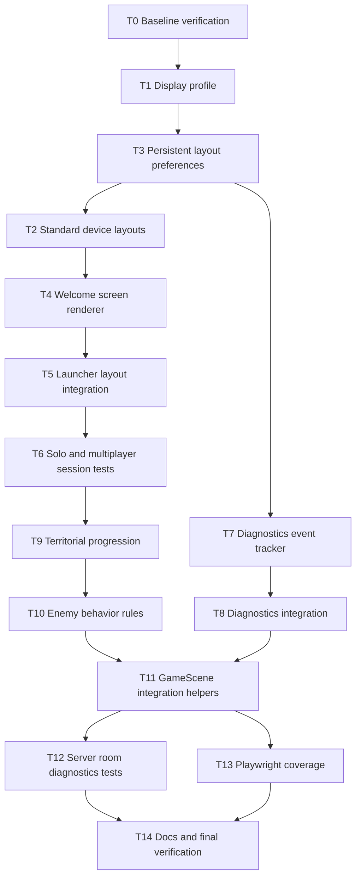

# Dignity2D Device Layout, Diagnostics, Welcome, Modes, Progression, And Enemy Test Plan

**Goal:** Add best-practice test coverage and implementation for display size detection, persistent standard layouts per device, welcome screen behavior, solo and multiplayer flows, privacy-safe diagnostic event tracking, territorial progression, and richer enemy behavior.

**Architecture:** Keep Dignity2D logic-first. New behavior lives in pure TypeScript modules under `src/display`, `src/welcome`, `src/diagnostics`, `src/progression`, and `src/enemies`, with thin integration into `src/launcher.ts`, `src/session.ts`, and `src/scenes/GameScene.ts`. Phaser-heavy behavior remains shallow in unit tests and is covered through helpers or Playwright.

**Tech Stack:** TypeScript, Vite, Phaser 3, Vitest with jsdom, Playwright, Node HTTP/WebSocket server, `ws`.

**Design Source:** `.github/superpower/brainstorm/2026-05-01-dignity-arcade-game-design.md`, `README.md`, and `architecture.md`.

**Estimated Complexity:** 15 tasks: 2 XS, 7 S, 6 M = medium-high scope focused on tests and integration polish.

**Critical Path:** T0 -> T1 -> T3 -> T2 -> T4 -> T5 -> T7 -> T9 -> T11 -> T13 -> T14.

**Risk Assessment:**

- Highest risk task: T7, diagnostics event tracker and integration. Diagnostics can accidentally collect user-identifying or sensitive room/upload data.
- Mitigation: Use strict event-name and payload-key allowlists, bounded local queue, shallow primitive payloads only, and tests that prove room IDs, image URLs, file names, and free text are dropped.
- Secondary risk task: T11, GameScene integration. Phaser scene tests can become brittle in jsdom.
- Mitigation: Keep new behavior in exported pure helpers and mock Phaser imports where scene modules are imported in Vitest.
- Third risk task: T10, enemy behavior. New pressure rules can alter game feel.
- Mitigation: Add pure behavior rules first, preserve existing enemy wave defaults, and integrate conservatively.

**Milestones:**

1. Device Foundation - T0 through T3
2. Welcome And Mode Coverage - T4 through T6
3. Diagnostics - T7 through T8
4. Territorial Progression And Enemies - T9 through T10
5. Scene, E2E, And Documentation - T11 through T14

---

## Dependency DAG



## Parallel Work

- After T3: T2 standard layouts and T7 diagnostics tracker can run independently.
- After T6: T9 territorial progression and T12 server-side room tests can be prepared independently, though T12 final assertions should wait for T8 naming conventions.
- After T10: T11 helper integration and T13 E2E test drafting can proceed in parallel if selectors are stable.

## Rollback Points

- **Rollback A after T2:** Device detection, layout persistence, and standard layouts complete. Rollback command: `git revert --no-commit HEAD~3..HEAD && git commit -m "revert: device layout foundation"`
- **Rollback B after T6:** Welcome and session-mode coverage complete. Rollback command: `git revert --no-commit HEAD~3..HEAD && git commit -m "revert: welcome and session coverage"`
- **Rollback C after T8:** Diagnostics layer complete and privacy-tested. Rollback command: `git revert --no-commit HEAD~2..HEAD && git commit -m "revert: diagnostics tracking"`
- **Rollback D after T11:** Gameplay progression, enemy behavior, and scene helpers complete. Rollback command: `git revert --no-commit HEAD~3..HEAD && git commit -m "revert: progression enemy scene integration"`
- **Rollback E after T14:** Full plan complete. Rollback command depends on commit grouping; if squashed, use `git revert <commit>`.

---

## T0: Baseline Verification [Size: XS] [Depends: none]

**Step 1: Run current unit suite**

- Command: `npm test`
- Expected output:

```text
Test Files  22 passed
Tests       all passed
```

**Step 2: Run build**

- Command: `npm run build`
- Expected output:

```text
vite build
built in
```

**Step 3: Run lint and format checks**

- Command: `npm run lint && npm run format`
- Expected output: no errors, Prettier reports all matched files use formatting.

**Step 4: Run E2E smoke tests**

- Command: `npm run test:e2e`
- Expected output:

```text
3 passed
```

---

## T1: Display Size Detection [Size: S] [Depends: T0]

**Step 1: Write failing tests**

- File: `src/display/DisplayProfile.test.ts`
- Code:

```typescript
import { describe, expect, it } from "vitest";
import { detectDisplayProfile, readDisplayProfileFromWindow } from "./DisplayProfile";

describe("detectDisplayProfile", () => {
  it("detects portrait phone layout", () => {
    const profile = detectDisplayProfile({ width: 390, height: 844, devicePixelRatio: 3 });
    expect(profile.deviceClass).toBe("phone");
    expect(profile.orientation).toBe("portrait");
    expect(profile.compactHud).toBe(true);
  });

  it("detects landscape phone layout", () => {
    const profile = detectDisplayProfile({ width: 844, height: 390, devicePixelRatio: 3 });
    expect(profile.deviceClass).toBe("phone");
    expect(profile.orientation).toBe("landscape");
  });

  it("detects tablet layout", () => {
    const profile = detectDisplayProfile({ width: 820, height: 1180, devicePixelRatio: 2 });
    expect(profile.deviceClass).toBe("tablet");
    expect(profile.orientation).toBe("portrait");
    expect(profile.compactHud).toBe(false);
  });

  it("detects desktop layout", () => {
    const profile = detectDisplayProfile({ width: 1440, height: 900, devicePixelRatio: 1 });
    expect(profile.deviceClass).toBe("desktop");
    expect(profile.orientation).toBe("landscape");
  });

  it("reads visualViewport before inner size when available", () => {
    const profile = readDisplayProfileFromWindow({
      innerWidth: 900,
      innerHeight: 900,
      devicePixelRatio: 2,
      visualViewport: { width: 390, height: 844 },
    });
    expect(profile.width).toBe(390);
    expect(profile.height).toBe(844);
    expect(profile.deviceClass).toBe("phone");
  });
});
```

**Step 2: Run test and verify failure**

- Command: `npm test -- src/display/DisplayProfile.test.ts`
- Expected output:

```text
FAIL src/display/DisplayProfile.test.ts
Error: Cannot find module './DisplayProfile'
```

**Step 3: Implement display profile module**

- File: `src/display/DisplayProfile.ts`
- Code:

```typescript
export type DisplayInput = {
  width: number;
  height: number;
  devicePixelRatio: number;
};

export type DeviceClass = "phone" | "tablet" | "desktop";
export type Orientation = "portrait" | "landscape";

export type DisplayProfile = {
  width: number;
  height: number;
  devicePixelRatio: number;
  deviceClass: DeviceClass;
  orientation: Orientation;
  compactHud: boolean;
};

type WindowLike = {
  innerWidth: number;
  innerHeight: number;
  devicePixelRatio?: number;
  visualViewport?: { width: number; height: number } | null;
};

export function detectDisplayProfile(input: DisplayInput): DisplayProfile {
  const width = Math.max(1, Math.round(input.width));
  const height = Math.max(1, Math.round(input.height));
  const shortest = Math.min(width, height);
  const longest = Math.max(width, height);
  const deviceClass: DeviceClass =
    shortest < 600 ? "phone" : longest < 1200 ? "tablet" : "desktop";

  return {
    width,
    height,
    devicePixelRatio: Math.max(1, input.devicePixelRatio),
    deviceClass,
    orientation: height >= width ? "portrait" : "landscape",
    compactHud: shortest < 420 || height < 720,
  };
}

export function readDisplayProfileFromWindow(source: WindowLike = window): DisplayProfile {
  return detectDisplayProfile({
    width: source.visualViewport?.width ?? source.innerWidth,
    height: source.visualViewport?.height ?? source.innerHeight,
    devicePixelRatio: source.devicePixelRatio ?? 1,
  });
}
```

**Step 4: Run test and verify success**

- Command: `npm test -- src/display/DisplayProfile.test.ts`
- Expected output:

```text
PASS src/display/DisplayProfile.test.ts
Tests  5 passed
```

---

## T3: Persistent Layout Preferences [Size: M] [Depends: T1]

**Step 1: Write failing tests**

- File: `src/display/LayoutPreferences.test.ts`
- Code:

```typescript
import { beforeEach, describe, expect, it } from "vitest";
import { loadLayoutPreference, saveLayoutPreference } from "./LayoutPreferences";

describe("LayoutPreferences", () => {
  beforeEach(() => localStorage.clear());

  it("returns null when no layout is stored", () => {
    expect(loadLayoutPreference("phone")).toBeNull();
  });

  it("persists a layout by device class", () => {
    saveLayoutPreference("phone", {
      layoutId: "portrait-phone-standard",
      joystickScale: 1.2,
      handedness: "left",
    });
    expect(loadLayoutPreference("phone")).toEqual({
      layoutId: "portrait-phone-standard",
      joystickScale: 1.2,
      handedness: "left",
    });
  });

  it("keeps tablet and phone preferences separate", () => {
    saveLayoutPreference("phone", {
      layoutId: "portrait-phone-standard",
      joystickScale: 1,
      handedness: "left",
    });
    expect(loadLayoutPreference("tablet")).toBeNull();
  });

  it("ignores malformed stored values", () => {
    localStorage.setItem("dignity.layout.phone.v1", "{bad");
    expect(loadLayoutPreference("phone")).toBeNull();
  });

  it("rejects invalid handedness", () => {
    localStorage.setItem(
      "dignity.layout.phone.v1",
      JSON.stringify({ layoutId: "portrait-phone-standard", joystickScale: 1, handedness: "middle" }),
    );
    expect(loadLayoutPreference("phone")).toBeNull();
  });
});
```

**Step 2: Run test and verify failure**

- Command: `npm test -- src/display/LayoutPreferences.test.ts`
- Expected output:

```text
FAIL src/display/LayoutPreferences.test.ts
Error: Cannot find module './LayoutPreferences'
```

**Step 3: Implement persistent layout preferences**

- File: `src/display/LayoutPreferences.ts`
- Code:

```typescript
import type { DeviceClass } from "./DisplayProfile";

export type Handedness = "left" | "right";

export type LayoutPreference = {
  layoutId: string;
  joystickScale: number;
  handedness: Handedness;
};

function keyFor(deviceClass: DeviceClass): string {
  return `dignity.layout.${deviceClass}.v1`;
}

function isHandedness(value: unknown): value is Handedness {
  return value === "left" || value === "right";
}

export function loadLayoutPreference(deviceClass: DeviceClass): LayoutPreference | null {
  try {
    const raw = localStorage.getItem(keyFor(deviceClass));
    if (!raw) return null;
    const parsed = JSON.parse(raw) as Partial<LayoutPreference>;
    if (
      typeof parsed.layoutId !== "string" ||
      typeof parsed.joystickScale !== "number" ||
      !isHandedness(parsed.handedness)
    ) {
      return null;
    }
    return {
      layoutId: parsed.layoutId,
      joystickScale: parsed.joystickScale,
      handedness: parsed.handedness,
    };
  } catch {
    return null;
  }
}

export function saveLayoutPreference(
  deviceClass: DeviceClass,
  preference: LayoutPreference,
): void {
  localStorage.setItem(keyFor(deviceClass), JSON.stringify(preference));
}
```

**Step 4: Run display tests and verify success**

- Command: `npm test -- src/display/LayoutPreferences.test.ts`
- Expected output:

```text
PASS src/display/LayoutPreferences.test.ts
Tests  5 passed
```

---

## T2: Standard Device Layouts [Size: S] [Depends: T3]

**Step 1: Write failing tests**

- File: `src/display/DeviceLayout.test.ts`
- Code:

```typescript
import { describe, expect, it } from "vitest";
import { getStandardLayout, resolveLayoutWithPreference } from "./DeviceLayout";

describe("DeviceLayout", () => {
  it("places joystick left and ability right for phone portrait", () => {
    const layout = getStandardLayout({ deviceClass: "phone", orientation: "portrait", compactHud: true });
    expect(layout.id).toBe("portrait-phone-standard");
    expect(layout.joystick.anchor).toBe("bottom-left");
    expect(layout.ability.anchor).toBe("bottom-right");
    expect(layout.hud.compact).toBe(true);
  });

  it("uses stable landscape phone layout", () => {
    const layout = getStandardLayout({ deviceClass: "phone", orientation: "landscape", compactHud: true });
    expect(layout.id).toBe("landscape-phone-standard");
    expect(layout.board.maxHeight).toBeLessThanOrEqual(360);
  });

  it("uses wider HUD on desktop", () => {
    const layout = getStandardLayout({ deviceClass: "desktop", orientation: "landscape", compactHud: false });
    expect(layout.hud.compact).toBe(false);
    expect(layout.board.maxWidth).toBeGreaterThan(600);
  });

  it("applies persisted joystick scale within bounds", () => {
    const layout = resolveLayoutWithPreference(
      { deviceClass: "phone", orientation: "portrait", compactHud: true },
      { layoutId: "portrait-phone-standard", joystickScale: 1.5, handedness: "right" },
    );
    expect(layout.joystick.size).toBe(144);
    expect(layout.joystick.anchor).toBe("bottom-right");
    expect(layout.ability.anchor).toBe("bottom-left");
  });
});
```

**Step 2: Run test and verify failure**

- Command: `npm test -- src/display/DeviceLayout.test.ts`
- Expected output:

```text
FAIL src/display/DeviceLayout.test.ts
Error: Cannot find module './DeviceLayout'
```

**Step 3: Implement standard layouts**

- File: `src/display/DeviceLayout.ts`
- Code:

```typescript
import type { DeviceClass, Orientation } from "./DisplayProfile";
import type { LayoutPreference } from "./LayoutPreferences";

export type LayoutAnchor = "top-left" | "top-right" | "bottom-left" | "bottom-right";

export type StandardLayout = {
  id: string;
  board: { maxWidth: number; maxHeight: number };
  joystick: { anchor: LayoutAnchor; size: number };
  ability: { anchor: LayoutAnchor; size: number };
  hud: { compact: boolean; topOffset: number };
};

export type LayoutContext = {
  deviceClass: DeviceClass;
  orientation: Orientation;
  compactHud: boolean;
};

function clampScale(scale: number): number {
  return Math.max(0.8, Math.min(1.5, scale));
}

export function getStandardLayout(input: LayoutContext): StandardLayout {
  if (input.deviceClass === "desktop") {
    return {
      id: "desktop-standard",
      board: { maxWidth: 720, maxHeight: 720 },
      joystick: { anchor: "bottom-left", size: 112 },
      ability: { anchor: "bottom-right", size: 88 },
      hud: { compact: false, topOffset: 24 },
    };
  }

  if (input.deviceClass === "tablet") {
    return {
      id: `${input.orientation}-tablet-standard`,
      board: { maxWidth: 600, maxHeight: 760 },
      joystick: { anchor: "bottom-left", size: 112 },
      ability: { anchor: "bottom-right", size: 88 },
      hud: { compact: input.compactHud, topOffset: 22 },
    };
  }

  return {
    id: `${input.orientation}-phone-standard`,
    board: {
      maxWidth: input.orientation === "portrait" ? 390 : 620,
      maxHeight: input.orientation === "portrait" ? 560 : 360,
    },
    joystick: { anchor: "bottom-left", size: 96 },
    ability: { anchor: "bottom-right", size: 76 },
    hud: { compact: true, topOffset: 18 },
  };
}

export function resolveLayoutWithPreference(
  input: LayoutContext,
  preference: LayoutPreference | null,
): StandardLayout {
  const base = getStandardLayout(input);
  if (!preference || preference.layoutId !== base.id) return base;

  const rightHanded = preference.handedness === "right";
  return {
    ...base,
    joystick: {
      ...base.joystick,
      anchor: rightHanded ? "bottom-right" : "bottom-left",
      size: Math.round(base.joystick.size * clampScale(preference.joystickScale)),
    },
    ability: {
      ...base.ability,
      anchor: rightHanded ? "bottom-left" : "bottom-right",
    },
  };
}
```

**Step 4: Run test and verify success**

- Command: `npm test -- src/display/DeviceLayout.test.ts`
- Expected output:

```text
PASS src/display/DeviceLayout.test.ts
Tests  4 passed
```

**Rollback Point A Verification**

- Command: `npm test -- src/display`
- Expected output: all display tests pass.

---

## T4: Welcome Screen Renderer [Size: M] [Depends: T3]

**Step 1: Write failing tests**

- File: `src/welcome/WelcomeScreen.test.ts`
- Code:

```typescript
import { describe, expect, it } from "vitest";
import { createWelcomeScreenHtml } from "./WelcomeScreen";

describe("createWelcomeScreenHtml", () => {
  it("renders primary welcome actions", () => {
    document.body.innerHTML = createWelcomeScreenHtml();
    expect(document.querySelector("#quick-play-button")?.textContent).toBe("Quick Play");
    expect(document.querySelector("#create-room-button")?.textContent).toBe("Create Room");
    expect(document.querySelector("#join-room-button")?.textContent).toBe("Join");
    expect(document.querySelector("#upload-trigger-button")?.textContent).toBe("Upload Image");
  });

  it("renders settings and accessibility controls", () => {
    document.body.innerHTML = createWelcomeScreenHtml();
    expect(document.querySelector("#settings-button")?.textContent).toBe("Settings");
    expect(document.querySelector("#accessibility-button")?.textContent).toBe("Accessibility");
  });

  it("keeps calm welcome copy visible", () => {
    document.body.innerHTML = createWelcomeScreenHtml();
    expect(document.querySelector("#welcome-title")?.textContent).toContain("Reveal");
    expect(document.querySelector("#home-status")?.textContent).toBe("Ready");
  });
});
```

**Step 2: Run test and verify failure**

- Command: `npm test -- src/welcome/WelcomeScreen.test.ts`
- Expected output:

```text
FAIL src/welcome/WelcomeScreen.test.ts
Error: Cannot find module './WelcomeScreen'
```

**Step 3: Implement welcome renderer**

- File: `src/welcome/WelcomeScreen.ts`
- Code:

```typescript
export function createWelcomeScreenHtml(): string {
  return `
    <main id="launcher-shell" style="max-width: 420px; margin: 0 auto; padding: 20px 16px 28px; color: #f7edc5; font-family: Georgia, serif;">
      <section style="background: linear-gradient(180deg, rgba(21,17,33,0.96), rgba(12,10,20,0.98)); border: 1px solid rgba(255,215,0,0.28); border-radius: 16px; padding: 24px 18px; box-shadow: 0 24px 80px rgba(0,0,0,0.35);">
        <p style="margin: 0; letter-spacing: 0.12em; font-size: 12px; color: #c8a96e; text-transform: uppercase;">Dignity Arcade</p>
        <h1 id="welcome-title" style="margin: 10px 0 8px; font-size: 34px; line-height: 1.05; color: #ffd700;">Reveal, restore, and reconnect.</h1>
        <p style="margin: 0 0 18px; color: #e6dec0; line-height: 1.5;">Choose solo, create a room, join a friend, or upload a private image.</p>

        <div style="display: grid; gap: 12px; margin-bottom: 18px;">
          <button id="quick-play-button" type="button" style="padding: 14px 16px; border-radius: 14px; border: 0; background: #00ffff; color: #0a0812; font-size: 18px; font-weight: 700; cursor: pointer;">Quick Play</button>
          <button id="create-room-button" type="button" style="padding: 14px 16px; border-radius: 14px; border: 1px solid rgba(255,255,255,0.18); background: rgba(255,255,255,0.06); color: white; font-size: 18px; cursor: pointer;">Create Room</button>
        </div>

        <section aria-label="Room controls" style="display: grid; gap: 10px; margin-bottom: 18px;">
          <label for="room-id-input" style="font-size: 14px; color: #c8a96e;">Join an existing room</label>
          <div style="display: grid; grid-template-columns: 1fr auto; gap: 10px;">
            <input id="room-id-input" type="text" placeholder="room-1" style="padding: 12px 14px; border-radius: 12px; border: 1px solid rgba(255,255,255,0.16); background: rgba(0,0,0,0.18); color: white;" />
            <button id="join-room-button" type="button" style="padding: 12px 16px; border-radius: 12px; border: 1px solid rgba(255,215,0,0.32); background: rgba(255,215,0,0.08); color: #ffd700; cursor: pointer;">Join</button>
          </div>
          <p id="current-room-label" style="margin: 0; min-height: 20px; color: #e6dec0; font-size: 14px;">No room created yet.</p>
        </section>

        <section aria-label="Image upload" style="display: grid; gap: 10px;">
          <div style="display: flex; align-items: center; justify-content: space-between; gap: 12px;">
            <div>
              <p style="margin: 0; color: #c8a96e; font-size: 14px;">Uploaded image preview</p>
              <p id="upload-filename" style="margin: 4px 0 0; color: #e6dec0; font-size: 13px; min-height: 18px;">Using default hidden image.</p>
            </div>
            <button id="upload-trigger-button" type="button" style="padding: 10px 14px; border-radius: 12px; border: 1px solid rgba(0,255,255,0.35); background: rgba(0,255,255,0.08); color: #00ffff; cursor: pointer;">Upload Image</button>
          </div>
          
          <input id="upload-input" type="file" accept="image/png,image/jpeg,image/webp" style="display: none;" />
        </section>

        <div style="display: grid; grid-template-columns: 1fr 1fr; gap: 10px; margin-top: 16px;">
          <button id="settings-button" type="button">Settings</button>
          <button id="accessibility-button" type="button">Accessibility</button>
        </div>

        <p id="home-status" style="margin: 18px 0 0; min-height: 24px; color: #c8a96e; text-align: center;">Ready</p>
      </section>
    </main>
    <button id="return-to-launcher-button" type="button" style="display: none; position: fixed; top: 16px; right: 16px; z-index: 10; padding: 10px 14px; border-radius: 12px; border: 1px solid rgba(255,215,0,0.35); background: rgba(10,8,18,0.88); color: #ffd700; cursor: pointer;">Return to launcher</button>
  `;
}
```

**Step 4: Refactor launcher to use renderer**

- File: `src/launcher.ts`
- Change:

```typescript
import { createWelcomeScreenHtml } from "./welcome/WelcomeScreen";
```

- Replace the private `createShell()` function and this line:

```typescript
app.innerHTML = createShell();
```

- With:

```typescript
app.innerHTML = createWelcomeScreenHtml();
```

**Step 5: Run tests and verify success**

- Command: `npm test -- src/welcome/WelcomeScreen.test.ts && npm run test:e2e`
- Expected output:

```text
PASS src/welcome/WelcomeScreen.test.ts
3 passed
```

---

## T5: Launcher Layout Integration [Size: M] [Depends: T4]

**Step 1: Write failing tests**

- File: `src/launcher.test.ts`
- Code:

```typescript
import { beforeEach, describe, expect, it, vi } from "vitest";

vi.mock("./bootstrap", () => ({
  startGameSession: vi.fn(async () => ({ scene: { start: vi.fn() } })),
  stopGameSession: vi.fn(),
}));

import { mountLauncher } from "./launcher";
import { startGameSession } from "./bootstrap";

describe("launcher layout integration", () => {
  beforeEach(() => {
    document.body.innerHTML = "";
    localStorage.clear();
    vi.mocked(startGameSession).mockClear();
  });

  it("detects display and stores layout metadata on the shell", () => {
    mountLauncher();
    const shell = document.querySelector<HTMLElement>("#launcher-shell");
    expect(shell?.dataset.deviceClass).toBe("desktop");
    expect(shell?.dataset.layoutId).toBe("desktop-standard");
  });

  it("passes resolved layout id into quick play launch data", async () => {
    mountLauncher();
    document.querySelector<HTMLButtonElement>("#quick-play-button")?.click();
    await new Promise((resolve) => setTimeout(resolve, 0));
    expect(startGameSession).toHaveBeenCalledWith(expect.objectContaining({ layoutId: "desktop-standard" }));
  });
});
```

**Step 2: Run test and verify failure**

- Command: `npm test -- src/launcher.test.ts`
- Expected output:

```text
FAIL src/launcher.test.ts
AssertionError: expected undefined to be 'desktop-standard'
```

**Step 3: Extend launch data**

- File: `src/session.ts`
- Code:

```typescript
export type GameSessionMode = "solo" | "multiplayer";

export type GameLaunchData = {
  levelId?: string;
  roomId?: string;
  playerId?: string;
  imageId?: string;
  imageUrl?: string;
  stateVersion?: number;
  layoutId?: string;
};

let pendingLaunchData: GameLaunchData = {};

export function setPendingLaunchData(data: GameLaunchData): void {
  pendingLaunchData = data;
}

export function getPendingLaunchData(): GameLaunchData {
  return pendingLaunchData;
}

export function resolveSessionMode(data: GameLaunchData): GameSessionMode {
  return data.roomId && data.playerId ? "multiplayer" : "solo";
}
```

**Step 4: Integrate layout detection in launcher**

- File: `src/launcher.ts`
- Add imports:

```typescript
import { getStandardLayout } from "./display/DeviceLayout";
import { readDisplayProfileFromWindow } from "./display/DisplayProfile";
import { loadLayoutPreference } from "./display/LayoutPreferences";
```

- Add after `state` creation:

```typescript
const displayProfile = readDisplayProfileFromWindow();
const layout = getStandardLayout(displayProfile);
const savedLayout = loadLayoutPreference(displayProfile.deviceClass);
const resolvedLayoutId = savedLayout?.layoutId ?? layout.id;

const shell = document.querySelector<HTMLElement>("#launcher-shell");
if (shell) {
  shell.dataset.deviceClass = displayProfile.deviceClass;
  shell.dataset.layoutId = resolvedLayoutId;
}
```

- Add `layoutId: resolvedLayoutId` to all calls to `startGame({ ... })`.

**Step 5: Run tests and verify success**

- Command: `npm test -- src/launcher.test.ts src/session.test.ts src/bootstrap.test.ts`
- Expected output:

```text
PASS src/launcher.test.ts
PASS src/session.test.ts
PASS src/bootstrap.test.ts
```

---

## T6: Solo And Multiplayer Session Tests [Size: S] [Depends: T5]

**Step 1: Write failing tests**

- File: `src/session.test.ts`
- Code:

```typescript
import { describe, expect, it } from "vitest";
import { getPendingLaunchData, resolveSessionMode, setPendingLaunchData } from "./session";

describe("session", () => {
  it("treats missing room as solo", () => {
    expect(resolveSessionMode({ imageId: "default-image" })).toBe("solo");
  });

  it("treats room launches with player id as multiplayer", () => {
    expect(resolveSessionMode({ roomId: "room-1", playerId: "p1" })).toBe("multiplayer");
  });

  it("does not treat incomplete room data as multiplayer", () => {
    expect(resolveSessionMode({ roomId: "room-1" })).toBe("solo");
  });

  it("preserves layout data in pending launch state", () => {
    setPendingLaunchData({ imageId: "img-1", layoutId: "portrait-phone-standard" });
    expect(getPendingLaunchData()).toEqual({ imageId: "img-1", layoutId: "portrait-phone-standard" });
  });
});
```

**Step 2: Run tests and verify failure if session work was not completed in T5**

- Command: `npm test -- src/session.test.ts`
- Expected output before implementation:

```text
FAIL src/session.test.ts
Error: resolveSessionMode is not exported
```

**Step 3: Implement missing session helpers**

- File: `src/session.ts`
- Apply the complete code from T5 Step 3 if not already present.

**Step 4: Run relevant session and mode tests**

- Command: `npm test -- src/session.test.ts src/net/serverApi.test.ts src/bootstrap.test.ts`
- Expected output:

```text
PASS src/session.test.ts
PASS src/net/serverApi.test.ts
PASS src/bootstrap.test.ts
```

**Rollback Point B Verification**

- Command: `npm test -- src/display src/welcome src/session.test.ts src/launcher.test.ts`
- Expected output: all tests pass.

---

## T7: Privacy-Safe Diagnostic Event Tracker [Size: M] [Depends: T3]

**Step 1: Write failing tests**

- File: `src/diagnostics/EventTracker.test.ts`
- Code:

```typescript
import { describe, expect, it, vi } from "vitest";
import { createEventTracker } from "./EventTracker";

describe("EventTracker", () => {
  it("stores allowlisted events in order", () => {
    const tracker = createEventTracker({ now: () => 10 });
    tracker.track("welcome_viewed", { deviceClass: "phone" });
    expect(tracker.snapshot()).toEqual([
      { name: "welcome_viewed", at: 10, payload: { deviceClass: "phone" } },
    ]);
  });

  it("rejects unknown events", () => {
    const tracker = createEventTracker();
    expect(() => tracker.track("room-1" as never)).toThrow("Unsupported diagnostic event.");
  });

  it("drops unsafe payload keys", () => {
    const tracker = createEventTracker({ now: () => 1 });
    tracker.track("solo_started", { imageUrl: "secret", fileName: "private.png", mode: "solo" } as never);
    expect(tracker.snapshot()[0]?.payload).toEqual({ mode: "solo" });
  });

  it("bounds the event queue", () => {
    const tracker = createEventTracker({ now: () => 1, maxEvents: 2 });
    tracker.track("welcome_viewed");
    tracker.track("display_detected");
    tracker.track("layout_loaded");
    expect(tracker.snapshot().map((event) => event.name)).toEqual(["display_detected", "layout_loaded"]);
  });

  it("flushes to a sink and clears events", () => {
    const sink = vi.fn();
    const tracker = createEventTracker({ sink });
    tracker.track("enemy_collision", { enemyKind: "chaser" });
    tracker.flush();
    expect(sink).toHaveBeenCalledTimes(1);
    expect(tracker.snapshot()).toEqual([]);
  });
});
```

**Step 2: Run test and verify failure**

- Command: `npm test -- src/diagnostics/EventTracker.test.ts`
- Expected output:

```text
FAIL src/diagnostics/EventTracker.test.ts
Error: Cannot find module './EventTracker'
```

**Step 3: Implement event tracker**

- File: `src/diagnostics/EventTracker.ts`
- Code:

```typescript
export type DiagnosticEventName =
  | "welcome_viewed"
  | "display_detected"
  | "layout_loaded"
  | "layout_saved"
  | "solo_started"
  | "multiplayer_started"
  | "room_created"
  | "room_joined"
  | "capture_committed"
  | "trail_cancelled"
  | "enemy_collision"
  | "performance_fallback";

export type DiagnosticPayload = Record<string, string | number | boolean>;

export type DiagnosticEvent = {
  name: DiagnosticEventName;
  at: number;
  payload: DiagnosticPayload;
};

const allowedNames = new Set<DiagnosticEventName>([
  "welcome_viewed",
  "display_detected",
  "layout_loaded",
  "layout_saved",
  "solo_started",
  "multiplayer_started",
  "room_created",
  "room_joined",
  "capture_committed",
  "trail_cancelled",
  "enemy_collision",
  "performance_fallback",
]);

const allowedPayloadKeys = new Set([
  "deviceClass",
  "orientation",
  "compactHud",
  "layoutId",
  "mode",
  "enemyKind",
  "revealedRatio",
  "stateVersion",
  "reason",
]);

export function createEventTracker(
  options: {
    now?: () => number;
    sink?: (events: DiagnosticEvent[]) => void;
    maxEvents?: number;
  } = {},
) {
  const now = options.now ?? Date.now;
  const sink = options.sink ?? (() => undefined);
  const maxEvents = options.maxEvents ?? 100;
  const events: DiagnosticEvent[] = [];

  return {
    track(name: DiagnosticEventName, payload: DiagnosticPayload = {}) {
      if (!allowedNames.has(name)) {
        throw new Error("Unsupported diagnostic event.");
      }

      const safePayload = Object.fromEntries(
        Object.entries(payload).filter(([key]) => allowedPayloadKeys.has(key)),
      ) as DiagnosticPayload;

      events.push({ name, at: now(), payload: safePayload });
      while (events.length > maxEvents) events.shift();
    },
    snapshot() {
      return [...events];
    },
    flush() {
      if (events.length === 0) return;
      sink([...events]);
      events.length = 0;
    },
  };
}
```

**Step 4: Run test and verify success**

- Command: `npm test -- src/diagnostics/EventTracker.test.ts`
- Expected output:

```text
PASS src/diagnostics/EventTracker.test.ts
Tests  5 passed
```

---

## T8: Diagnostics Integration Contracts [Size: S] [Depends: T7]

**Step 1: Write failing tests**

- File: `src/diagnostics/integration.test.ts`
- Code:

```typescript
import { describe, expect, it } from "vitest";
import { createEventTracker } from "./EventTracker";
import { resolveSessionMode } from "../session";

describe("diagnostics integration contracts", () => {
  it("tracks solo and multiplayer modes without IDs", () => {
    const tracker = createEventTracker({ now: () => 1 });
    const soloMode = resolveSessionMode({ imageId: "default-image" });
    const multiplayerMode = resolveSessionMode({ roomId: "room-1", playerId: "p1" });

    tracker.track(soloMode === "solo" ? "solo_started" : "multiplayer_started", {
      mode: soloMode,
      imageId: "not-allowed",
    } as never);
    tracker.track(multiplayerMode === "multiplayer" ? "multiplayer_started" : "solo_started", {
      mode: multiplayerMode,
      roomId: "not-allowed",
    } as never);

    expect(tracker.snapshot()).toEqual([
      { name: "solo_started", at: 1, payload: { mode: "solo" } },
      { name: "multiplayer_started", at: 1, payload: { mode: "multiplayer" } },
    ]);
  });

  it("tracks display and layout without raw viewport dimensions", () => {
    const tracker = createEventTracker({ now: () => 2 });
    tracker.track("display_detected", {
      deviceClass: "phone",
      orientation: "portrait",
      width: 390,
      height: 844,
    } as never);
    tracker.track("layout_loaded", { layoutId: "portrait-phone-standard" });
    expect(tracker.snapshot()).toEqual([
      {
        name: "display_detected",
        at: 2,
        payload: { deviceClass: "phone", orientation: "portrait" },
      },
      {
        name: "layout_loaded",
        at: 2,
        payload: { layoutId: "portrait-phone-standard" },
      },
    ]);
  });
});
```

**Step 2: Run test and verify failure or missing behavior**

- Command: `npm test -- src/diagnostics/integration.test.ts`
- Expected output before dependencies are complete:

```text
FAIL src/diagnostics/integration.test.ts
Error: resolveSessionMode is not exported
```

**Step 3: Implement missing dependencies**

- File: `src/session.ts`
- Ensure T5/T6 session helpers are present.
- File: `src/diagnostics/EventTracker.ts`
- Ensure payload key filter excludes raw dimensions, IDs, image URLs, file names, and free text.

**Step 4: Run diagnostics tests and verify success**

- Command: `npm test -- src/diagnostics`
- Expected output:

```text
PASS src/diagnostics/EventTracker.test.ts
PASS src/diagnostics/integration.test.ts
```

**Rollback Point C Verification**

- Command: `npm test -- src/diagnostics src/session.test.ts`
- Expected output: all tests pass.

---

## T9: Territorial Progression [Size: S] [Depends: T6]

**Step 1: Write failing tests**

- File: `src/progression/territoryProgression.test.ts`
- Code:

```typescript
import { describe, expect, it } from "vitest";
import { getTerritoryStage, listTerritoryMilestones } from "./territoryProgression";

describe("territoryProgression", () => {
  it("starts at border camp", () => {
    expect(getTerritoryStage(0).id).toBe("border-camp");
  });

  it("advances at 25 percent reveal", () => {
    expect(getTerritoryStage(0.25).id).toBe("safe-quarter");
  });

  it("advances at 50 percent reveal", () => {
    expect(getTerritoryStage(0.5).id).toBe("inner-district");
  });

  it("marks 75 percent as secured", () => {
    expect(getTerritoryStage(0.75).id).toBe("image-secured");
  });

  it("clamps values above full reveal", () => {
    expect(getTerritoryStage(2).id).toBe("image-secured");
  });

  it("lists milestones in ascending order", () => {
    expect(listTerritoryMilestones().map((item) => item.threshold)).toEqual([0, 0.25, 0.5, 0.75]);
  });
});
```

**Step 2: Run test and verify failure**

- Command: `npm test -- src/progression/territoryProgression.test.ts`
- Expected output:

```text
FAIL src/progression/territoryProgression.test.ts
Error: Cannot find module './territoryProgression'
```

**Step 3: Implement territorial progression**

- File: `src/progression/territoryProgression.ts`
- Code:

```typescript
export type TerritoryStage = {
  id: "border-camp" | "safe-quarter" | "inner-district" | "image-secured";
  label: string;
  threshold: number;
};

const stages: TerritoryStage[] = [
  { id: "border-camp", label: "Border Camp", threshold: 0 },
  { id: "safe-quarter", label: "Safe Quarter", threshold: 0.25 },
  { id: "inner-district", label: "Inner District", threshold: 0.5 },
  { id: "image-secured", label: "Image Secured", threshold: 0.75 },
];

export function listTerritoryMilestones(): TerritoryStage[] {
  return [...stages];
}

export function getTerritoryStage(revealedRatio: number): TerritoryStage {
  const clamped = Math.max(0, Math.min(1, revealedRatio));
  return stages.reduce((current, stage) =>
    clamped >= stage.threshold ? stage : current,
  );
}
```

**Step 4: Run progression tests and verify success**

- Command: `npm test -- src/progression`
- Expected output:

```text
PASS src/progression/builds.test.ts
PASS src/progression/territoryProgression.test.ts
```

---

## T10: Enemy Behavior Rules [Size: M] [Depends: T9]

**Step 1: Write failing tests**

- File: `src/enemies/EnemyBehavior.test.ts`
- Code:

```typescript
import { describe, expect, it } from "vitest";
import { chooseEnemyIntent, scaleEnemyPressure } from "./EnemyBehavior";

describe("EnemyBehavior", () => {
  it("chasers target active trails", () => {
    expect(chooseEnemyIntent("chaser", { activeTrailCount: 1, bothPlayersDrawing: false })).toBe("hunt-trail");
  });

  it("shooters keep predictable lanes", () => {
    expect(chooseEnemyIntent("shooter", { activeTrailCount: 0, bothPlayersDrawing: false })).toBe("fire-lane");
  });

  it("orbiters guard captured or high-value areas", () => {
    expect(chooseEnemyIntent("orbiter", { activeTrailCount: 0, bothPlayersDrawing: false })).toBe("guard-area");
  });

  it("disruptors pressure co-op overextension", () => {
    expect(chooseEnemyIntent("disruptor", { activeTrailCount: 2, bothPlayersDrawing: true })).toBe("disrupt-coop");
  });

  it("scales pressure when both co-op players draw", () => {
    expect(scaleEnemyPressure(30, { bothPlayersDrawing: true })).toBe(39);
  });

  it("keeps pressure unchanged during solo drawing", () => {
    expect(scaleEnemyPressure(30, { bothPlayersDrawing: false })).toBe(30);
  });
});
```

**Step 2: Run test and verify failure**

- Command: `npm test -- src/enemies/EnemyBehavior.test.ts`
- Expected output:

```text
FAIL src/enemies/EnemyBehavior.test.ts
Error: Cannot find module './EnemyBehavior'
```

**Step 3: Implement enemy behavior rules**

- File: `src/enemies/EnemyBehavior.ts`
- Code:

```typescript
import type { EnemyKind } from "../game/types";

export type EnemyIntent = "patrol" | "hunt-trail" | "fire-lane" | "guard-area" | "disrupt-coop";

export type EnemyPressureContext = {
  activeTrailCount: number;
  bothPlayersDrawing: boolean;
};

export function chooseEnemyIntent(
  kind: EnemyKind,
  context: EnemyPressureContext,
): EnemyIntent {
  if (kind === "disruptor" && context.bothPlayersDrawing) return "disrupt-coop";
  if (kind === "chaser" && context.activeTrailCount > 0) return "hunt-trail";
  if (kind === "shooter") return "fire-lane";
  if (kind === "orbiter") return "guard-area";
  return "patrol";
}

export function scaleEnemyPressure(
  baseSpeed: number,
  context: Pick<EnemyPressureContext, "bothPlayersDrawing">,
): number {
  return context.bothPlayersDrawing ? Math.round(baseSpeed * 1.3) : baseSpeed;
}
```

**Step 4: Strengthen existing enemy spawner tests**

- File: `src/enemies/EnemySpawner.test.ts`
- Add tests:

```typescript
it("caps enemy count for mobile readability", () => {
  expect(createEnemyWave(99, { width: 300, height: 400 })).toHaveLength(8);
});

it("keeps enemies inside board bounds", () => {
  const wave = createEnemyWave(5, { width: 300, height: 400 });
  expect(wave.every((enemy) => enemy.position.x >= 0 && enemy.position.x <= 300)).toBe(true);
  expect(wave.every((enemy) => enemy.position.y >= 0 && enemy.position.y <= 400)).toBe(true);
});
```

**Step 5: Run enemy tests and verify success**

- Command: `npm test -- src/enemies`
- Expected output:

```text
PASS src/enemies/EnemySpawner.test.ts
PASS src/enemies/EnemyBehavior.test.ts
```

---

## T11: GameScene Integration Helpers [Size: M] [Depends: T8, T10]

**Step 1: Write failing tests**

- File: `src/scenes/GameScene.test.ts`
- Add tests to the existing suite:

```typescript
it("reports solo and multiplayer status labels without leaking image URLs", () => {
  expect(makeGameStatusText({ roomId: undefined, imageId: "default-image", imageUrl: "https://private.test/img" }, false, 0, "Border Camp")).toBe("Image default-image");
  expect(makeGameStatusText({ roomId: "room-1", imageId: "img-1", imageUrl: "https://private.test/img" }, false, 0, "Border Camp")).toBe("Room room-1");
});

it("shows secured status when the game is won", () => {
  expect(makeGameStatusText({}, true, 2, "Image Secured")).toBe("Image secured");
});

it("falls back to territory stage before enemy count", () => {
  expect(makeGameStatusText({}, false, 3, "Safe Quarter")).toBe("Safe Quarter");
});

it("applies persisted layout id to scene launch data", () => {
  const launchData = makeSceneLaunchData({ imageId: "img-1", layoutId: "portrait-phone-standard" });
  expect(launchData.layoutId).toBe("portrait-phone-standard");
});
```

**Step 2: Run test and verify failure**

- Command: `npm test -- src/scenes/GameScene.test.ts`
- Expected output:

```text
FAIL src/scenes/GameScene.test.ts
ReferenceError: makeGameStatusText is not defined
```

**Step 3: Implement exported scene helpers**

- File: `src/scenes/GameScene.ts`
- Add exports near other helper functions:

```typescript
export function makeSceneLaunchData(data: GameLaunchData): GameLaunchData {
  return { ...data };
}

export function makeGameStatusText(
  launchData: GameLaunchData,
  won: boolean,
  enemyCount: number,
  territoryLabel?: string,
): string {
  if (won) return "Image secured";
  if (launchData.roomId) return `Room ${launchData.roomId}`;
  if (launchData.imageId) return `Image ${launchData.imageId}`;
  return territoryLabel ?? `Enemies ${enemyCount}`;
}
```

- Update `init` to use `makeSceneLaunchData`:

```typescript
this.launchData = makeSceneLaunchData({ ...getPendingLaunchData(), ...data });
```

- Update `renderState` status assignment to use `getTerritoryStage` and `makeGameStatusText`:

```typescript
const territoryStage = getTerritoryStage(this.state.revealedRatio);
this.statusText?.setText(
  makeGameStatusText(
    this.launchData,
    this.state.won,
    this.state.enemies.length,
    territoryStage.label,
  ),
);
```

- Add import:

```typescript
import { getTerritoryStage } from "../progression/territoryProgression";
```

**Step 4: Run scene tests and verify success**

- Command: `npm test -- src/scenes/GameScene.test.ts`
- Expected output:

```text
PASS src/scenes/GameScene.test.ts
```

**Rollback Point D Verification**

- Command: `npm test -- src/progression src/enemies src/scenes/GameScene.test.ts`
- Expected output: all tests pass.

---

## T12: Server Room Diagnostics And Multiplayer State Tests [Size: S] [Depends: T8]

**Step 1: Strengthen room manager tests**

- File: `server/rooms/RoomManager.test.ts`
- Add tests:

```typescript
it("rejects a third player", () => {
  const manager = new RoomManager();
  const room = manager.createRoom("img-1");
  expect(manager.joinRoom(room.id)?.players).toHaveLength(2);
  expect(manager.joinRoom(room.id)).toBeNull();
});

it("increments state version when a second player joins", () => {
  const manager = new RoomManager();
  const room = manager.createRoom("img-1");
  expect(room.stateVersion).toBe(0);
  expect(manager.joinRoom(room.id)?.stateVersion).toBe(1);
});
```

**Step 2: Strengthen server websocket tests**

- File: `server/index.test.ts`
- Add test:

```typescript
it("returns websocket errors for missing reconnect rooms", async () => {
  const app = createAppServer();
  activeServers.push(app);
  await app.listen();

  const received = await new Promise<{ type: string; message?: string }>((resolve, reject) => {
    const socket = new WebSocket(app.getUrl().replace("http", "ws"));
    socket.once("open", () => {
      socket.send(JSON.stringify({ type: "reconnect", roomId: "missing", playerId: "p1" }));
    });
    socket.once("message", (message) => {
      socket.close();
      resolve(JSON.parse(message.toString()) as { type: string; message?: string });
    });
    socket.once("error", reject);
  });

  expect(received).toEqual({ type: "error", message: "Room not found." });
});
```

**Step 3: Run tests and verify expected pass or failure**

- Command: `npm test -- server/rooms/RoomManager.test.ts server/index.test.ts`
- Expected output after implementation:

```text
PASS server/rooms/RoomManager.test.ts
PASS server/index.test.ts
```

---

## T13: Playwright Welcome, Solo, Multiplayer, And Layout Smoke [Size: M] [Depends: T11]

**Step 1: Extend E2E tests**

- File: `tests/e2e/home.spec.ts`
- Add tests:

```typescript
test("mobile welcome keeps primary controls visible", async ({ page }) => {
  await page.setViewportSize({ width: 390, height: 844 });
  await page.goto("/");
  await expect(page.locator("#launcher-shell")).toBeVisible();
  await expect(page.locator("#quick-play-button")).toBeVisible();
  await expect(page.locator("#create-room-button")).toBeVisible();
  await expect(page.locator("#settings-button")).toBeVisible();
  await expect(page.locator("#accessibility-button")).toBeVisible();
});

test("quick play starts a solo canvas with persisted layout metadata", async ({ page }) => {
  await page.goto("/");
  await expect(page.locator("#launcher-shell")).toHaveAttribute("data-layout-id", /standard/);
  await page.locator("#quick-play-button").click();
  await expect(page.locator("canvas")).toBeVisible();
});
```

**Step 2: Run E2E tests and verify expected failure if controls are absent**

- Command: `npm run test:e2e`
- Expected output before welcome integration is complete:

```text
FAIL tests/e2e/home.spec.ts
locator('#settings-button') not found
```

**Step 3: Implement missing selectors and launcher data attributes**

- File: `src/welcome/WelcomeScreen.ts`
- Ensure `#settings-button` and `#accessibility-button` exist.
- File: `src/launcher.ts`
- Ensure `#launcher-shell` gets `data-device-class` and `data-layout-id`.

**Step 4: Run E2E tests and verify success**

- Command: `npm run test:e2e`
- Expected output:

```text
5 passed
```

---

## T14: Documentation And Full Verification [Size: S] [Depends: T12, T13]

**Step 1: Update README**

- File: `README.md`
- Add bullets under runtime or testing sections:

```markdown
- Display detection and standard device layouts live under `src/display`, with versioned local layout preferences per device class.
- Welcome-screen rendering is tested separately from launcher event wiring under `src/welcome`.
- Privacy-safe diagnostic event tracking lives under `src/diagnostics` and filters room IDs, image URLs, file names, and free text from payloads.
- Territorial progression milestones live under `src/progression/territoryProgression.ts`.
```

**Step 2: Update architecture**

- File: `architecture.md`
- Add ownership notes:

```markdown
### Display, Layout, And Diagnostics

`src/display` owns viewport-to-device classification, standard control/HUD layouts, and versioned layout preference persistence. `src/welcome` owns testable launcher markup. `src/diagnostics` owns privacy-safe event tracking for local diagnostics and future observability sinks.

Territorial progression lives in `src/progression/territoryProgression.ts`, while enemy intent and pressure rules live in `src/enemies/EnemyBehavior.ts`.
```

**Step 3: Run focused verification**

- Command: `npm test -- src/display src/welcome src/diagnostics src/progression src/enemies src/scenes/GameScene.test.ts src/session.test.ts src/launcher.test.ts`
- Expected output: all listed tests pass.

**Step 4: Run full verification**

- Commands:

```bash
npm test
npm run build
npm run lint
npm run format
npm run perf:mobile
npm run test:e2e
```

- Expected output:

```text
npm test: all Vitest files pass
npm run build: TypeScript and Vite build pass
npm run lint: no errors
npm run format: all matched files use Prettier formatting
npm run perf:mobile: performance profile tests pass
npm run test:e2e: all Playwright tests pass
```

---

## Final Verification Checklist

- [ ] Baseline tests passed before edits.
- [ ] Display detection covers phone, tablet, desktop, portrait, landscape, and `visualViewport`.
- [ ] Standard layouts cover phone, tablet, desktop, portrait, landscape, compact HUD, handedness, and joystick scale.
- [ ] Layout preferences are persistent, versioned, per device class, and resilient to malformed storage.
- [ ] Welcome screen has testable markup for Quick Play, Create Room, Join, Upload Image, Settings, and Accessibility.
- [ ] Solo and multiplayer launch modes are explicit and unit-tested.
- [ ] Room create, join, full-room, invalid reconnect, and state-version behavior are tested.
- [ ] Diagnostics use event and payload allowlists.
- [ ] Diagnostics drop room IDs, image IDs where not explicitly allowed, image URLs, file names, free text, and raw viewport dimensions.
- [ ] Territorial progression has deterministic tests for 0%, 25%, 50%, 75%, and >100% reveal.
- [ ] Enemy behavior covers chaser, shooter, orbiter, disruptor, mobile caps, and co-op overextension pressure.
- [ ] GameScene integration remains helper-driven and does not require real canvas in Vitest.
- [ ] Playwright covers welcome, mobile viewport, solo launch, create-room launch, join-room launch, upload flow, and return-to-launcher flow.
- [ ] README and architecture docs reflect the new modules.
- [ ] Full verification commands pass.

## Handoff To Execute

Execute this plan with `superpower-execute`. Follow TDD order exactly: write the failing test, run it and confirm failure, implement the smallest matching behavior, then run the focused passing test before moving on. If a test exposes a design gap, pause and update this plan rather than patching around it.