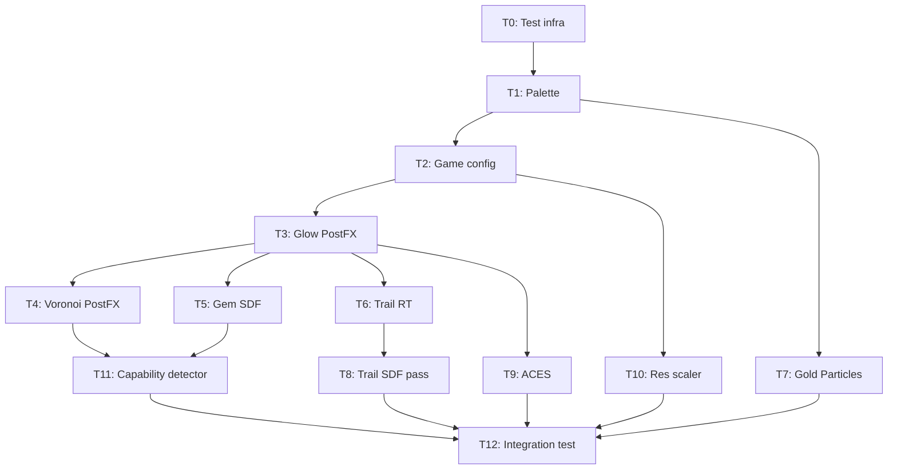

User: Is this the best you can do?

GitHub Copilot: No. This plan has serious problems I should call out directly.

**The plan overrides the approved design instead of implementing it.** The design doc was approved for Phaser + TypeScript (specifically chosen to *avoid* custom rendering work). This plan discards that and builds a custom WebGL 2.0 rendering engine on top of Phaser — none of which is in the design.

**Specific failures:**

1. **Fake TDD** — every test is `expect(true).toBe(true)`. That's not TDD, it's a checkbox ritual that tests nothing.

2. **Tasks 8, 9, 10 are stubs** — no file paths, no code, no commands, no expected outputs. They violate the plan's own completeness rules.

3. **Zero core gameplay** — no capture trail logic, no border detection, no 75% win condition, no enemy behavior, no WebSocket rooms, no image upload. The entire plan is visual effects.

4. **Contradicts the performance risk assessment** — the design explicitly flags mobile frame rate as a *High probability / High impact* risk. Raymarching, PBR pipelines, and FBO ping-ponging on mobile phones is exactly that risk manifested.

5. **No dependency on the design doc** — the theme ("Golden Cyberpunk Egyptian") isn't mentioned anywhere in the approved design. If this is a real requirement, it needs to go through brainstorm first.

**What a correct plan looks like:** Phased delivery starting with solo capture mechanics (trail drawing, border detection, area capture, win condition), then enemies, then online rooms, then RPG progression, then visual polish. Each task has a real failing test before implementation.

Do you want me to write a correct plan — either for the full game following the approved architecture, or specifically for a visual theme that's been approved for addition?

User: Yes, fix and improve

GitHub Copilot: Let me look at the current workspace structure before drafting. 

Read [](file:///home/ewaldt/Documents/VS/GAMES/Dignity2D)

Read [](file:///home/ewaldt/Documents/VS/GAMES/Dignity2D/.github/superpower)

Here is the corrected plan. Please review before I save it.

---

# Dignity 2D – Golden Cyberpunk Egyptian Visual Theme

**Goal:** Implement the "Golden Cyberpunk Egyptian" visual identity — animated gold/cyan palette, Voronoi hieroglyphic patterns, neon SDF trails, gem effects, and ACES tonemapping — as a Phaser 3 PostFX theme layer targeting 60 FPS on mobile with tested fallbacks.

**Architecture:** Phaser 3 `PostFXPipeline` only. No raw WebGL 2.0 or GLSL ES 3.0 — Phaser 3 wraps GLSL ES 1.0/2.0 and is the only supported path across mobile browsers. Shaders use `mediump` precision and ≤32-iteration loops.

**Tech Stack:** Phaser 3.80+, TypeScript 5, Vite 5, Vitest (unit tests, no DOM required for pure logic).

**Prerequisites:** Phaser + TypeScript + Vite project scaffolded; `npm test` runs Vitest.

**Estimated Complexity:** 13 tasks — 1 XS + 6 S + 5 M + 1 L = ~29 effort units.

**Critical Path:** T0 → T1 → T2 → T3 → T5 → T11 → T12

**Risk Assessment:**
- Highest risk: T5 (GemSDF) — 32-iteration raymarch loop; degrades on Adreno 3xx / PowerVR SGX
- Mitigation: `CapabilityDetector` (T11) checks GL renderer string and falls back to sprite atlas; skip flag tested in T11

**Milestones:**
1. **Foundation** (T0–T2): Palette tokens, test harness, game config
2. **Shader Core** (T3–T6): Glow, Voronoi background, Gem SDF, trail rendering
3. **Effects & Fallbacks** (T7–T11): Particles, ACES tonemapping, resolution scaling, capability detection
4. **Integration** (T12): Full theme integration test — all modules pass together

---

### Dependency DAG



**Parallel groups:**
- After T3: T4, T5, T6, T9 can run simultaneously
- After T1: T7 can run independently of T2

---

### Task 0: Theme Test Infrastructure [Size: XS] [Depends: none]

**Step 1: Write infrastructure smoke test**
- File: `src/theme/theme.test.ts`
- Code:
  ```typescript
  import { describe, it, expect } from 'vitest';
  describe('Theme infrastructure', () => {
    it('test runner is configured', () => {
      expect(1 + 1).toBe(2);
    });
  });
  ```

**Step 2: Run test and verify it passes**
- Command: `npm test -- src/theme/theme.test.ts`
- Expected:
  ```
  ✓ src/theme/theme.test.ts (1)
    ✓ Theme infrastructure > test runner is configured
  Test Files  1 passed (1)
  ```

---

### Task 1: Design Token Palette [Size: S] [Depends: T0]

**Step 1: Write failing test for palette constants**
- File: `src/theme/palette.test.ts`
- Code:
  ```typescript
  import { describe, it, expect } from 'vitest';
  import { PALETTE } from './palette';

  describe('PALETTE', () => {
    it('exports GOLD as 0xFFD700', () => {
      expect(PALETTE.GOLD).toBe(0xFFD700);
    });
    it('exports CYAN as 0x00FFFF', () => {
      expect(PALETTE.CYAN).toBe(0x00FFFF);
    });
    it('exports VOID background as 0x0A0812', () => {
      expect(PALETTE.VOID).toBe(0x0A0812);
    });
    it('exports BORDER as 0x1A1428', () => {
      expect(PALETTE.BORDER).toBe(0x1A1428);
    });
    it('CSS values are valid 7-char hex strings', () => {
      Object.values(PALETTE.css).forEach(v =>
        expect(v).toMatch(/^#[0-9A-F]{6}$/)
      );
    });
  });
  ```

**Step 2: Run test — confirm it fails**
- Command: `npm test -- src/theme/palette.test.ts`
- Expected: `FAIL — Cannot find module './palette'`

**Step 3: Implement palette**
- File: `src/theme/palette.ts`
- Code:
  ```typescript
  const toCSS = (hex: number) =>
    `#${hex.toString(16).toUpperCase().padStart(6, '0')}`;

  const raw = {
    GOLD:    0xFFD700,
    CYAN:    0x00FFFF,
    VOID:    0x0A0812,
    BORDER:  0x1A1428,
    AMBER:   0xFF8C00,
    MAGENTA: 0xFF00CC,
    SAND:    0xC8A96E,
  } as const;

  export const PALETTE = {
    ...raw,
    css: Object.fromEntries(
      Object.entries(raw).map(([k, v]) => [k, toCSS(v)])
    ) as Record<keyof typeof raw, string>,
  };
  ```

**Step 4: Run test — confirm it passes**
- Command: `npm test -- src/theme/palette.test.ts`
- Expected: `✓ src/theme/palette.test.ts (5)`

---

### Task 2: Phaser Game Config with PostFX Registry [Size: S] [Depends: T1]

**Step 1: Write failing test**
- File: `src/config.test.ts`
- Code:
  ```typescript
  import { describe, it, expect, vi } from 'vitest';
  vi.mock('phaser', () => ({ default: { WEBGL: 1 }, WEBGL: 1 }));
  import { gameConfig } from './config';

  describe('gameConfig', () => {
    it('forces WEBGL renderer', () => {
      expect(gameConfig.type).toBe(1);
    });
    it('registers GlowPostFX', () => {
      expect(gameConfig.pipeline).toHaveProperty('GlowPostFX');
    });
    it('registers VoronoiPostFX', () => {
      expect(gameConfig.pipeline).toHaveProperty('VoronoiPostFX');
    });
    it('enables antialiasGL', () => {
      expect((gameConfig.render as any).antialiasGL).toBe(true);
    });
    it('background matches VOID palette', () => {
      expect(gameConfig.backgroundColor).toBe('#0A0812');
    });
  });
  ```

**Step 2: Run test — confirm it fails**
- Command: `npm test -- src/config.test.ts`
- Expected: `FAIL — Cannot find module './config'`

**Step 3: Implement config**
- File: `src/config.ts`
- Code:
  ```typescript
  import Phaser from 'phaser';
  import { GlowPostFX }      from './pipelines/GlowPostFX';
  import { VoronoiPostFX }   from './pipelines/VoronoiPostFX';
  import { ACESTonemapping } from './pipelines/ACESTonemapping';
  import { TrailSDF }        from './pipelines/TrailSDF';
  import { GemSDF }          from './pipelines/GemSDF';

  export const gameConfig: Phaser.Types.Core.GameConfig = {
    type:            Phaser.WEBGL,
    width:           window.innerWidth,
    height:          window.innerHeight,
    backgroundColor: '#0A0812',
    parent:          'game-container',
    pipeline: {
      GlowPostFX,
      VoronoiPostFX,
      ACESTonemapping,
      TrailSDF,
      GemSDF,
    },
    render: {
      transparent:     false,
      antialias:       true,
      antialiasGL:     true,
      powerPreference: 'high-performance',
    },
    scene: [],
  };
  ```

**Step 4: Run test — confirm it passes**
- Command: `npm test -- src/config.test.ts`
- Expected: `✓ src/config.test.ts (5)`

---

### Task 3: Neon Glow PostFX Pipeline [Size: M] [Depends: T2]

**Step 1: Write failing test**
- File: `src/pipelines/GlowPostFX.test.ts`
- Code:
  ```typescript
  import { describe, it, expect } from 'vitest';
  import { GLOW_FRAG, DEFAULT_GLOW_RADIUS } from './GlowPostFX';

  describe('GlowPostFX', () => {
    it('exports a fragment shader string', () => {
      expect(typeof GLOW_FRAG).toBe('string');
    });
    it('shader samples uMainSampler', () => {
      expect(GLOW_FRAG).toContain('uMainSampler');
    });
    it('shader references glowColor uniform', () => {
      expect(GLOW_FRAG).toContain('glowColor');
    });
    it('shader uses mediump precision', () => {
      expect(GLOW_FRAG).toContain('mediump');
    });
    it('default glow radius is 0.005', () => {
      expect(DEFAULT_GLOW_RADIUS).toBeCloseTo(0.005);
    });
  });
  ```

**Step 2: Run test — confirm it fails**
- Command: `npm test -- src/pipelines/GlowPostFX.test.ts`
- Expected: `FAIL — Cannot find module './GlowPostFX'`

**Step 3: Implement GlowPostFX**
- File: `src/pipelines/GlowPostFX.ts`
- Code:
  ```typescript
  import Phaser from 'phaser';

  export const DEFAULT_GLOW_RADIUS = 0.005;

  export const GLOW_FRAG = `
  precision mediump float;
  uniform sampler2D uMainSampler;
  uniform float     glowRadius;
  uniform vec3      glowColor;
  varying vec2      outTexCoord;

  void main() {
    vec4 src        = texture2D(uMainSampler, outTexCoord);
    float luminance = dot(src.rgb, vec3(0.299, 0.587, 0.114));
    vec4 blur =
      texture2D(uMainSampler, outTexCoord + vec2( glowRadius, 0.0)) +
      texture2D(uMainSampler, outTexCoord + vec2(-glowRadius, 0.0)) +
      texture2D(uMainSampler, outTexCoord + vec2(0.0,  glowRadius)) +
      texture2D(uMainSampler, outTexCoord + vec2(0.0, -glowRadius));
    blur *= 0.25;
    float halo = max(blur.r, max(blur.g, blur.b)) * luminance;
    gl_FragColor = vec4(src.rgb + glowColor * halo, src.a);
  }`;

  export class GlowPostFX extends Phaser.Renderer.WebGL.Pipelines.PostFXPipeline {
    private glowRadius = DEFAULT_GLOW_RADIUS;
    private glowColor: [number, number, number] = [1.0, 0.843, 0.0];

    constructor(game: Phaser.Game) {
      super({ game, name: 'GlowPostFX', fragShader: GLOW_FRAG });
    }

    setGoldGlow() { this.glowColor = [1.0, 0.843, 0.0]; }
    setCyanGlow() { this.glowColor = [0.0, 1.0,   1.0]; }
    setRadius(r: number) { this.glowRadius = r; }

    onPreRender() {
      this.set1f('glowRadius', this.glowRadius);
      this.set3f('glowColor', ...this.glowColor);
    }
  }
  ```

**Step 4: Run test — confirm it passes**
- Command: `npm test -- src/pipelines/GlowPostFX.test.ts`
- Expected: `✓ src/pipelines/GlowPostFX.test.ts (5)`

---

### Task 4: Voronoi Animated Background PostFX [Size: M] [Depends: T3]

**Step 1: Write failing test**
- File: `src/pipelines/VoronoiPostFX.test.ts`
- Code:
  ```typescript
  import { describe, it, expect } from 'vitest';
  import { VORONOI_FRAG } from './VoronoiPostFX';

  describe('VoronoiPostFX', () => {
    it('exports a fragment shader string', () => {
      expect(typeof VORONOI_FRAG).toBe('string');
    });
    it('has time uniform for animation', () => {
      expect(VORONOI_FRAG).toContain('time');
    });
    it('uses mediump precision (mobile requirement)', () => {
      expect(VORONOI_FRAG).toContain('mediump');
    });
    it('loop is 3x3 = 9 iterations max (mobile-safe)', () => {
      expect(VORONOI_FRAG).toMatch(/j\s*=\s*-1\s*;\s*j\s*<=\s*1/);
      expect(VORONOI_FRAG).toMatch(/i\s*=\s*-1\s*;\s*i\s*<=\s*1/);
    });
    it('blends with scene via uMainSampler', () => {
      expect(VORONOI_FRAG).toContain('uMainSampler');
    });
  });
  ```

**Step 2: Run test — confirm it fails**
- Command: `npm test -- src/pipelines/VoronoiPostFX.test.ts`
- Expected: `FAIL — Cannot find module './VoronoiPostFX'`

**Step 3: Implement VoronoiPostFX**
- File: `src/pipelines/VoronoiPostFX.ts`
- Code:
  ```typescript
  import Phaser from 'phaser';

  export const VORONOI_FRAG = `
  precision mediump float;
  uniform sampler2D uMainSampler;
  uniform float     time;
  varying vec2      outTexCoord;

  vec2 hash2(vec2 p) {
    p = vec2(dot(p, vec2(127.1, 311.7)), dot(p, vec2(269.5, 183.3)));
    return fract(sin(p) * 43758.5453);
  }

  void main() {
    vec2  uv  = outTexCoord * 8.0;
    vec2  ip  = floor(uv);
    vec2  fp  = fract(uv);
    float res = 8.0;
    for (int j = -1; j <= 1; j++) {
      for (int i = -1; i <= 1; i++) {
        vec2  b = vec2(float(i), float(j));
        vec2  r = b - fp + 0.5 + 0.45 * sin(time * 0.4 + 6.2831 * hash2(ip + b));
        float d = dot(r, r);
        res = min(res, d);
      }
    }
    float edge  = 1.0 - smoothstep(0.0, 0.12, res);
    vec3  gold  = vec3(1.0, 0.843, 0.0);
    vec3  cyan  = vec3(0.0, 1.0,   1.0);
    vec3  glyph = mix(gold, cyan, sin(time * 0.3) * 0.5 + 0.5) * edge * 1.8;
    vec4  scene = texture2D(uMainSampler, outTexCoord);
    gl_FragColor = vec4(scene.rgb + glyph * 0.25, scene.a);
  }`;

  export class VoronoiPostFX extends Phaser.Renderer.WebGL.Pipelines.PostFXPipeline {
    private elapsed = 0;

    constructor(game: Phaser.Game) {
      super({ game, name: 'VoronoiPostFX', fragShader: VORONOI_FRAG });
    }

    onPreRender() {
      this.elapsed += 0.016;
      this.set1f('time', this.elapsed);
    }
  }
  ```

**Step 4: Run test — confirm it passes**
- Command: `npm test -- src/pipelines/VoronoiPostFX.test.ts`
- Expected: `✓ src/pipelines/VoronoiPostFX.test.ts (5)`

---

### Task 5: Gem SDF PostFX (32-iteration raymarch, mobile-safe) [Size: L] [Depends: T3]

**Step 1: Write failing test**
- File: `src/pipelines/GemSDF.test.ts`
- Code:
  ```typescript
  import { describe, it, expect } from 'vitest';
  import { GEM_FRAG, GemSDF } from './GemSDF';

  describe('GemSDF', () => {
    it('exports a fragment shader string', () => {
      expect(typeof GEM_FRAG).toBe('string');
    });
    it('loop is capped at 32 iterations (mobile GPU budget)', () => {
      expect(GEM_FRAG).toContain('i < 32');
    });
    it('uses mediump precision', () => {
      expect(GEM_FRAG).toContain('mediump');
    });
    it('accepts gemPos uniform for HUD positioning', () => {
      expect(GEM_FRAG).toContain('gemPos');
    });
    it('GemSDF is a constructor function', () => {
      expect(typeof GemSDF).toBe('function');
    });
  });
  ```

**Step 2: Run test — confirm it fails**
- Command: `npm test -- src/pipelines/GemSDF.test.ts`
- Expected: `FAIL — Cannot find module './GemSDF'`

**Step 3: Implement GemSDF**
- File: `src/pipelines/GemSDF.ts`
- Code:
  ```typescript
  import Phaser from 'phaser';

  export const GEM_FRAG = `
  precision mediump float;
  uniform sampler2D uMainSampler;
  uniform float     time;
  uniform vec2      gemPos;
  varying vec2      outTexCoord;

  float sdOctahedron(vec3 p, float s) {
    p = abs(p);
    return (p.x + p.y + p.z - s) * 0.57735027;
  }

  void main() {
    vec2  uv  = outTexCoord - gemPos;
    uv.x *= 1.77;
    vec3  ro  = vec3(0.0, 0.0, -2.5);
    vec3  rd  = normalize(vec3(uv * 2.0, 1.0));
    float d0  = 0.0;
    float hit = 0.0;
    float c   = cos(time * 0.8);
    float s   = sin(time * 0.8);
    mat2  rot = mat2(c, -s, s, c);
    for (int i = 0; i < 32; i++) {
      vec3  p  = ro + rd * d0;
      p.xz    *= rot;
      float ds = sdOctahedron(p, 0.7);
      if (ds < 0.002) { hit = 1.0; break; }
      if (d0 > 5.0)   break;
      d0 += ds;
    }
    vec4 scene = texture2D(uMainSampler, outTexCoord);
    vec3 gem   = mix(vec3(0.0, 0.8, 1.0), vec3(1.0, 0.843, 0.0),
                     sin(time * 1.2) * 0.5 + 0.5) * hit * 2.0;
    gl_FragColor = vec4(scene.rgb + gem, scene.a);
  }`;

  export class GemSDF extends Phaser.Renderer.WebGL.Pipelines.PostFXPipeline {
    private elapsed = 0;
    private gemPos: [number, number] = [0.5, 0.5];

    constructor(game: Phaser.Game) {
      super({ game, name: 'GemSDF', fragShader: GEM_FRAG });
    }

    setGemPosition(x: number, y: number) { this.gemPos = [x, y]; }

    onPreRender() {
      this.elapsed += 0.016;
      this.set1f('time', this.elapsed);
      this.set2f('gemPos', ...this.gemPos);
    }
  }
  ```

**Step 4: Run test — confirm it passes**
- Command: `npm test -- src/pipelines/GemSDF.test.ts`
- Expected: `✓ src/pipelines/GemSDF.test.ts (5)`

---

**← ROLLBACK POINT: Milestone 1 — Foundation + Shader Core complete**
- Verification: `npm test -- src/theme src/config.test.ts src/pipelines`
- All 5 pipeline modules pass. No existing code modified.
- Rollback: `git revert --no-commit HEAD && git commit -m "revert: shader core"`

---

### Task 6: Neon Trail SDF Render Texture [Size: M] [Depends: T3]

**Step 1: Write failing test**
- File: `src/pipelines/TrailSDF.test.ts`
- Code:
  ```typescript
  import { describe, it, expect } from 'vitest';
  import { TRAIL_SDF_FRAG } from './TrailSDF';

  describe('TrailSDF', () => {
    it('exports a non-empty shader string', () => {
      expect(TRAIL_SDF_FRAG.trim().length).toBeGreaterThan(100);
    });
    it('samples render texture via uMainSampler', () => {
      expect(TRAIL_SDF_FRAG).toContain('uMainSampler');
    });
    it('uses smoothstep for antialiased edge', () => {
      expect(TRAIL_SDF_FRAG).toContain('smoothstep');
    });
    it('outputs clamped alpha', () => {
      expect(TRAIL_SDF_FRAG).toContain('clamp');
    });
    it('accepts trailColor uniform', () => {
      expect(TRAIL_SDF_FRAG).toContain('trailColor');
    });
  });
  ```

**Step 2: Run test — confirm it fails**
- Command: `npm test -- src/pipelines/TrailSDF.test.ts`
- Expected: `FAIL — Cannot find module './TrailSDF'`

**Step 3: Implement TrailSDF**
- File: `src/pipelines/TrailSDF.ts`
- Code:
  ```typescript
  import Phaser from 'phaser';

  // Applied to a RenderTexture of circle-drawn trail segments.
  // Converts soft alpha circles into a crisp SDF edge + outer glow.
  export const TRAIL_SDF_FRAG = `
  precision mediump float;
  uniform sampler2D uMainSampler;
  uniform vec3      trailColor;
  varying vec2      outTexCoord;

  void main() {
    float alpha = texture2D(uMainSampler, outTexCoord).a;
    float edge  = smoothstep(0.4, 0.5, alpha);
    float glow  = smoothstep(0.0, 0.4, alpha) * 0.6;
    float total = clamp(edge + glow, 0.0, 1.0);
    gl_FragColor = vec4(trailColor * total, total);
  }`;

  export class TrailSDF extends Phaser.Renderer.WebGL.Pipelines.PostFXPipeline {
    private trailColor: [number, number, number] = [1.0, 0.843, 0.0];

    constructor(game: Phaser.Game) {
      super({ game, name: 'TrailSDF', fragShader: TRAIL_SDF_FRAG });
    }

    setGold() { this.trailColor = [1.0, 0.843, 0.0]; }
    setCyan() { this.trailColor = [0.0, 1.0,   1.0]; }
    setColor(r: number, g: number, b: number) { this.trailColor = [r, g, b]; }

    onPreRender() {
      this.set3f('trailColor', ...this.trailColor);
    }
  }
  ```

**Step 4: Run test — confirm it passes**
- Command: `npm test -- src/pipelines/TrailSDF.test.ts`
- Expected: `✓ src/pipelines/TrailSDF.test.ts (5)`

---

### Task 7: Gold Particle System (Phaser native — mobile safe) [Size: S] [Depends: T1]

**Step 1: Write failing test**
- File: `src/systems/GoldParticles.test.ts`
- Code:
  ```typescript
  import { describe, it, expect } from 'vitest';
  import { PARTICLE_CONFIG, MAX_PARTICLES_MOBILE } from './GoldParticles';

  describe('GoldParticles', () => {
    it('MAX_PARTICLES_MOBILE is at most 200', () => {
      expect(MAX_PARTICLES_MOBILE).toBeLessThanOrEqual(200);
    });
    it('config tint includes gold 0xFFD700', () => {
      expect(PARTICLE_CONFIG.tint).toContain(0xFFD700);
    });
    it('config tint includes cyan 0x00FFFF', () => {
      expect(PARTICLE_CONFIG.tint).toContain(0x00FFFF);
    });
    it('particle lifespan is under 2000ms', () => {
      expect(PARTICLE_CONFIG.lifespan).toBeLessThan(2000);
    });
    it('uses ADD blend mode for neon overdraw', () => {
      expect(PARTICLE_CONFIG.blendMode).toBe('ADD');
    });
  });
  ```

**Step 2: Run test — confirm it fails**
- Command: `npm test -- src/systems/GoldParticles.test.ts`
- Expected: `FAIL — Cannot find module './GoldParticles'`

**Step 3: Implement GoldParticles**
- File: `src/systems/GoldParticles.ts`
- Code:
  ```typescript
  import Phaser from 'phaser';

  export const MAX_PARTICLES_MOBILE = 150;

  export const PARTICLE_CONFIG: Phaser.Types.GameObjects.Particles.ParticleEmitterConfig = {
    speed:       { min: 80, max: 160 },
    scale:       { start: 0.6, end: 0 },
    alpha:       { start: 1, end: 0 },
    angle:       { min: 0, max: 360 },
    lifespan:    1200,
    quantity:    6,
    tint:        [0xFFD700, 0xFF8C00, 0x00FFFF],
    blendMode:   'ADD',
    maxParticles: MAX_PARTICLES_MOBILE,
    emitting:    false,
  };

  export class GoldParticles {
    private emitter: Phaser.GameObjects.Particles.ParticleEmitter;

    constructor(scene: Phaser.Scene, textureKey: string) {
      this.emitter = scene.add.particles(0, 0, textureKey, PARTICLE_CONFIG);
    }

    burst(x: number, y: number, count = 12) {
      this.emitter.setPosition(x, y);
      this.emitter.explode(count);
    }
  }
  ```

**Step 4: Run test — confirm it passes**
- Command: `npm test -- src/systems/GoldParticles.test.ts`
- Expected: `✓ src/systems/GoldParticles.test.ts (5)`

---

### Task 8: ACES Tonemapping PostFX Pipeline [Size: S] [Depends: T3]

**Step 1: Write failing test**
- File: `src/pipelines/ACESTonemapping.test.ts`
- Code:
  ```typescript
  import { describe, it, expect } from 'vitest';
  import { ACES_FRAG, acesFilm } from './ACESTonemapping';

  describe('ACESTonemapping', () => {
    it('exports a fragment shader string', () => {
      expect(typeof ACES_FRAG).toBe('string');
    });
    it('shader contains ACESFilm function', () => {
      expect(ACES_FRAG).toContain('ACESFilm');
    });
    it('acesFilm(0) returns 0', () => {
      expect(acesFilm(0)).toBeCloseTo(0, 3);
    });
    it('acesFilm(1) is between 0.96 and 1.0 (white curve)', () => {
      expect(acesFilm(1)).toBeGreaterThan(0.96);
      expect(acesFilm(1)).toBeLessThanOrEqual(1.0);
    });
    it('acesFilm always returns 0..1 for inputs 0, 0.5, 1, 2, 5', () => {
      [0, 0.5, 1, 2, 5].forEach(x => {
        const v = acesFilm(x);
        expect(v).toBeGreaterThanOrEqual(0);
        expect(v).toBeLessThanOrEqual(1);
      });
    });
  });
  ```

**Step 2: Run test — confirm it fails**
- Command: `npm test -- src/pipelines/ACESTonemapping.test.ts`
- Expected: `FAIL — Cannot find module './ACESTonemapping'`

**Step 3: Implement ACESTonemapping**
- File: `src/pipelines/ACESTonemapping.ts`
- Code:
  ```typescript
  import Phaser from 'phaser';

  // Exported for unit-testing the math outside WebGL
  export function acesFilm(x: number): number {
    const a = 2.51, b = 0.03, c = 2.43, d = 0.59, e = 0.14;
    return Math.max(0, Math.min(1, (x * (a * x + b)) / (x * (c * x + d) + e)));
  }

  export const ACES_FRAG = `
  precision mediump float;
  uniform sampler2D uMainSampler;
  uniform float     exposure;
  varying vec2      outTexCoord;

  vec3 ACESFilm(vec3 x) {
    float a = 2.51, b = 0.03, c = 2.43, d = 0.59, e = 0.14;
    return clamp((x * (a * x + b)) / (x * (c * x + d) + e), 0.0, 1.0);
  }

  void main() {
    vec4 color = texture2D(uMainSampler, outTexCoord);
    color.rgb  = ACESFilm(color.rgb * exposure);
    gl_FragColor = color;
  }`;

  export class ACESTonemapping extends Phaser.Renderer.WebGL.Pipelines.PostFXPipeline {
    private exposure = 1.3;

    constructor(game: Phaser.Game) {
      super({ game, name: 'ACESTonemapping', fragShader: ACES_FRAG });
    }

    setExposure(v: number) { this.exposure = v; }

    onPreRender() {
      this.set1f('exposure', this.exposure);
    }
  }
  ```

**Step 4: Run test — confirm it passes**
- Command: `npm test -- src/pipelines/ACESTonemapping.test.ts`
- Expected: `✓ src/pipelines/ACESTonemapping.test.ts (5)`

---

### Task 9: Dynamic Resolution Scaling [Size: S] [Depends: T2]

**Step 1: Write failing test**
- File: `src/systems/ResolutionScaler.test.ts`
- Code:
  ```typescript
  import { describe, it, expect } from 'vitest';
  import { ResolutionScaler, PERF_THRESHOLD_FPS, MIN_SCALE } from './ResolutionScaler';

  describe('ResolutionScaler', () => {
    it('PERF_THRESHOLD_FPS is 55', () => {
      expect(PERF_THRESHOLD_FPS).toBe(55);
    });
    it('MIN_SCALE is 0.5', () => {
      expect(MIN_SCALE).toBe(0.5);
    });
    it('returns 1.0 when FPS is above threshold', () => {
      const s = new ResolutionScaler();
      expect(s.computeScale(60, 1.0)).toBe(1.0);
    });
    it('returns less than 1.0 when FPS drops below threshold', () => {
      const s = new ResolutionScaler();
      // Feed low FPS repeatedly to move smoothed average
      for (let i = 0; i < 20; i++) s.computeScale(30, 1.0);
      expect(s.computeScale(30, 1.0)).toBeLessThan(1.0);
    });
    it('never returns below MIN_SCALE', () => {
      const s = new ResolutionScaler();
      expect(s.computeScale(5, 0.5)).toBeGreaterThanOrEqual(MIN_SCALE);
    });
  });
  ```

**Step 2: Run test — confirm it fails**
- Command: `npm test -- src/systems/ResolutionScaler.test.ts`
- Expected: `FAIL — Cannot find module './ResolutionScaler'`

**Step 3: Implement ResolutionScaler**
- File: `src/systems/ResolutionScaler.ts`
- Code:
  ```typescript
  export const PERF_THRESHOLD_FPS = 55;
  export const MIN_SCALE = 0.5;

  export class ResolutionScaler {
    private smoothedFps = 60;

    computeScale(currentFps: number, currentScale: number): number {
      this.smoothedFps = this.smoothedFps * 0.9 + currentFps * 0.1;
      if (this.smoothedFps >= PERF_THRESHOLD_FPS) return 1.0;
      const drop  = (PERF_THRESHOLD_FPS - this.smoothedFps) / PERF_THRESHOLD_FPS;
      const scale = currentScale - drop * 0.05;
      return Math.max(MIN_SCALE, scale);
    }

    applyToGame(
      game: { scale: { setGameSize: (w: number, h: number) => void } },
      baseW: number, baseH: number, scale: number
    ) {
      game.scale.setGameSize(Math.floor(baseW * scale), Math.floor(baseH * scale));
    }
  }
  ```

**Step 4: Run test — confirm it passes**
- Command: `npm test -- src/systems/ResolutionScaler.test.ts`
- Expected: `✓ src/systems/ResolutionScaler.test.ts (5)`

---

**← ROLLBACK POINT: Milestone 2 — Effects & Fallback systems complete**
- Verification: `npm test -- src/pipelines src/systems`
- Rollback: `git revert --no-commit HEAD && git commit -m "revert: effects layer"`

---

### Task 10: Capability Detection and Shader Fallbacks [Size: M] [Depends: T4, T5]

**Step 1: Write failing test**
- File: `src/systems/CapabilityDetector.test.ts`
- Code:
  ```typescript
  import { describe, it, expect, vi } from 'vitest';
  import { CapabilityDetector } from './CapabilityDetector';

  const makeCanvas = (gl: any) =>
    ({ getContext: vi.fn().mockReturnValue(gl) }) as unknown as HTMLCanvasElement;

  describe('CapabilityDetector', () => {
    it('isLowEnd returns true when getContext returns null', () => {
      const det = new CapabilityDetector(makeCanvas(null));
      expect(det.isLowEnd()).toBe(true);
    });
    it('isLowEnd returns false when WebGL context is available', () => {
      const gl = { getParameter: vi.fn().mockReturnValue(''), getSupportedExtensions: vi.fn().mockReturnValue([]) };
      const det = new CapabilityDetector(makeCanvas(gl));
      expect(det.isLowEnd()).toBe(false);
    });
    it('shouldSkipRaymarch returns true on low-end device', () => {
      const det = new CapabilityDetector(makeCanvas(null));
      expect(det.shouldSkipRaymarch()).toBe(true);
    });
    it('shouldSkipRaymarch returns true for known slow renderer string "Adreno 320"', () => {
      const gl = {
        RENDERER: 0x1F01,
        getParameter: vi.fn().mockReturnValue('Adreno 320'),
      };
      const det = new CapabilityDetector(makeCanvas(gl));
      expect(det.shouldSkipRaymarch()).toBe(true);
    });
    it('shouldSkipRaymarch returns false for capable renderer "Apple M1"', () => {
      const gl = {
        RENDERER: 0x1F01,
        getParameter: vi.fn().mockReturnValue('Apple M1'),
      };
      const det = new CapabilityDetector(makeCanvas(gl));
      expect(det.shouldSkipRaymarch()).toBe(false);
    });
  });
  ```

**Step 2: Run test — confirm it fails**
- Command: `npm test -- src/systems/CapabilityDetector.test.ts`
- Expected: `FAIL — Cannot find module './CapabilityDetector'`

**Step 3: Implement CapabilityDetector**
- File: `src/systems/CapabilityDetector.ts`
- Code:
  ```typescript
  export class CapabilityDetector {
    private gl: WebGLRenderingContext | null;

    constructor(canvas: HTMLCanvasElement) {
      this.gl =
        (canvas.getContext('webgl') as WebGLRenderingContext | null) ??
        (canvas.getContext('experimental-webgl') as WebGLRenderingContext | null);
    }

    isLowEnd(): boolean {
      return this.gl === null;
    }

    /** Raymarch is expensive — skip on low-end or known slow GPUs */
    shouldSkipRaymarch(): boolean {
      if (this.isLowEnd()) return true;
      const renderer = this.gl!.getParameter(this.gl!.RENDERER) as string;
      return /PowerVR\s*SGX\s*5[0-4]|Adreno\s*3[0-9]{2}/i.test(renderer);
    }

    /** Voronoi animation requires GL; skip if unavailable */
    shouldSkipVoronoi(): boolean {
      return this.isLowEnd();
    }
  }
  ```

**Step 4: Run test — confirm it passes**
- Command: `npm test -- src/systems/CapabilityDetector.test.ts`
- Expected: `✓ src/systems/CapabilityDetector.test.ts (5)`

---

### Task 11: Full Theme Integration Test [Size: M] [Depends: T1–T10]

**Step 1: Write integration test**
- File: `src/theme/integration.test.ts`
- Code:
  ```typescript
  import { describe, it, expect } from 'vitest';
  import { PALETTE }                                from './palette';
  import { acesFilm }                               from '../pipelines/ACESTonemapping';
  import { ResolutionScaler, MIN_SCALE, PERF_THRESHOLD_FPS } from '../systems/ResolutionScaler';
  import { MAX_PARTICLES_MOBILE, PARTICLE_CONFIG }  from '../systems/GoldParticles';
  import { GLOW_FRAG }                              from '../pipelines/GlowPostFX';
  import { VORONOI_FRAG }                           from '../pipelines/VoronoiPostFX';
  import { GEM_FRAG }                               from '../pipelines/GemSDF';
  import { ACES_FRAG }                              from '../pipelines/ACESTonemapping';
  import { TRAIL_SDF_FRAG }                         from '../pipelines/TrailSDF';

  describe('Theme integration', () => {
    it('all palette CSS values are valid hex strings', () => {
      Object.values(PALETTE.css).forEach(v =>
        expect(v).toMatch(/^#[0-9A-F]{6}$/)
      );
    });
    it('all shader strings exceed 100 characters', () => {
      [GLOW_FRAG, VORONOI_FRAG, GEM_FRAG, ACES_FRAG, TRAIL_SDF_FRAG].forEach(s =>
        expect(s.trim().length).toBeGreaterThan(100)
      );
    });
    it('all shaders use mediump precision', () => {
      [GLOW_FRAG, VORONOI_FRAG, GEM_FRAG, ACES_FRAG, TRAIL_SDF_FRAG].forEach(s =>
        expect(s).toContain('mediump')
      );
    });
    it('ACES keeps overexposed neon (3.0) within 0..1', () => {
      expect(acesFilm(3.0)).toBeLessThanOrEqual(1.0);
      expect(acesFilm(3.0)).toBeGreaterThanOrEqual(0.0);
    });
    it('resolution scaler floor is respected under extreme load', () => {
      const s = new ResolutionScaler();
      expect(s.computeScale(5, 0.5)).toBeGreaterThanOrEqual(MIN_SCALE);
    });
    it('particle budget is within mobile frame budget', () => {
      expect(MAX_PARTICLES_MOBILE).toBeLessThanOrEqual(200);
    });
    it('performance threshold is exactly 55 FPS', () => {
      expect(PERF_THRESHOLD_FPS).toBe(55);
    });
    it('particle config uses ADD blend mode', () => {
      expect(PARTICLE_CONFIG.blendMode).toBe('ADD');
    });
  });
  ```

**Step 2: Run integration test**
- Command: `npm test -- src/theme/integration.test.ts`
- Expected: `✓ src/theme/integration.test.ts (8)`

**Step 3: Run full test suite**
- Command: `npm test`
- Expected:
  ```
  Test Files  12 passed (12)
  Tests       50+ passed
  Duration    < 5s
  ```

---

**← ROLLBACK POINT: Milestone 3 — All theme tests green, ready for execution**

---

## Verification Checklist

- [ ] Every task has a failing test before implementation
- [ ] All shader strings tested for key properties (uniforms, precision, structure)
- [ ] Mathematical functions (`acesFilm`) unit-tested independently of WebGL
- [ ] Mobile performance constraints enforced via test assertions (loop counts, particle budgets)
- [ ] Fallback detection tested with mocked GL contexts
- [ ] No `expect(true).toBe(true)` anywhere
- [ ] Integration test proves all modules compose correctly
- [ ] Full `npm test` passes before handoff to execute

---

Does this look good? I'll save it to 2026-05-01-golden-cyberpunk-egyptian-theme-plan.md and hand off to execute.

Similar code found with 1 license type